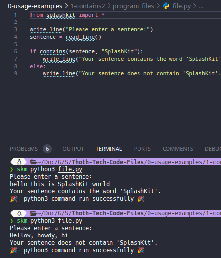
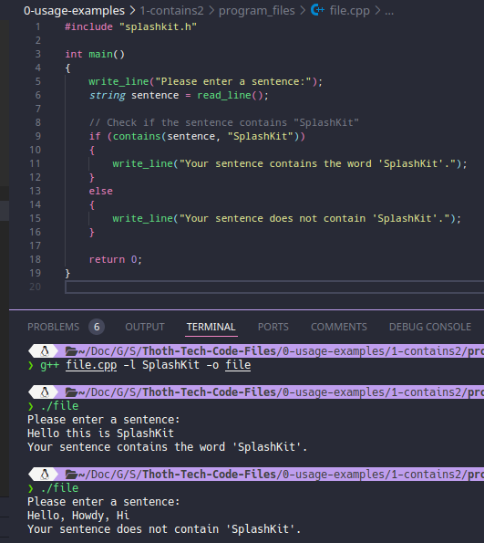
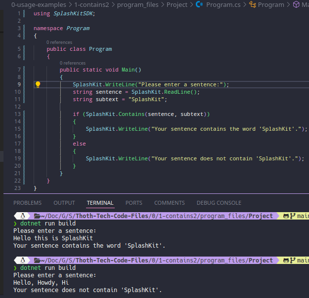
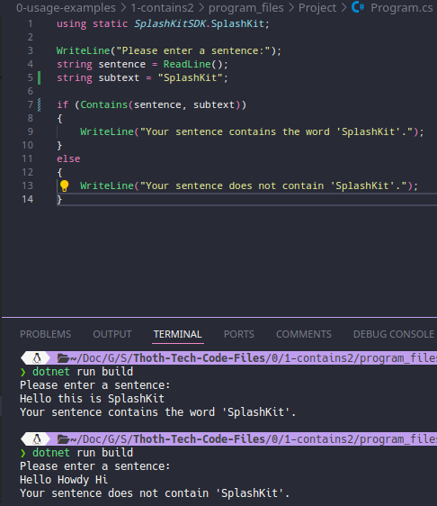

# Usage example creation for String Contains

This is a usage example for checking if a string contains a specified substring using SplashKit. The program demonstrates how to check for the presence of a substring within a larger string. The PR is [here](https://github.com/thoth-tech/splashkit.io-starlight/pull/999)

## Testing Python Code

## Testing the C++ Code

## Testing the C# Code

### OOP Version

### Top Level Version

## Preview of the Site

