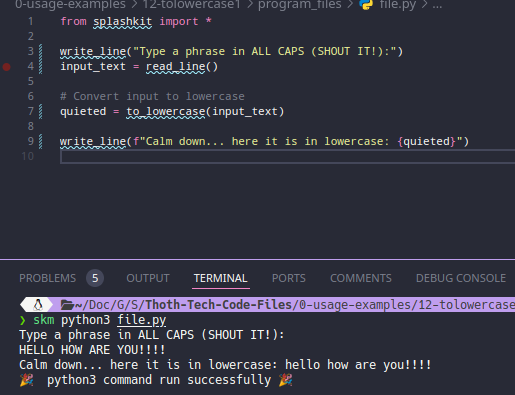
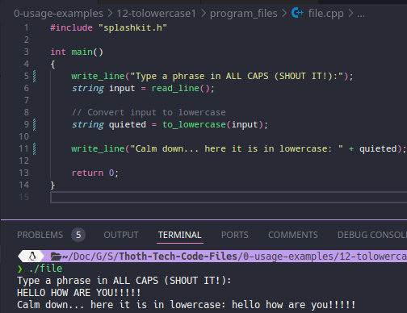
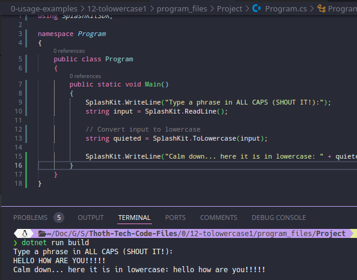
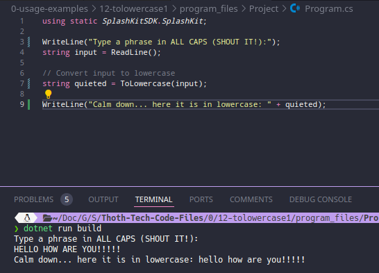

# Usage example creation for Convert String to Lowercase

This is a usage example for converting a user-inputted string to lowercase using SplashKit. The program prompts the user for a string, converts it to lowercase, and displays the result. The PR is [here](https://github.com/thoth-tech/splashkit.io-starlight/pull/999)

## Testing Python Code

## Testing the C++ Code

## Testing the C# Code

### OOP Version

### Top Level Version

## Preview of the Site

