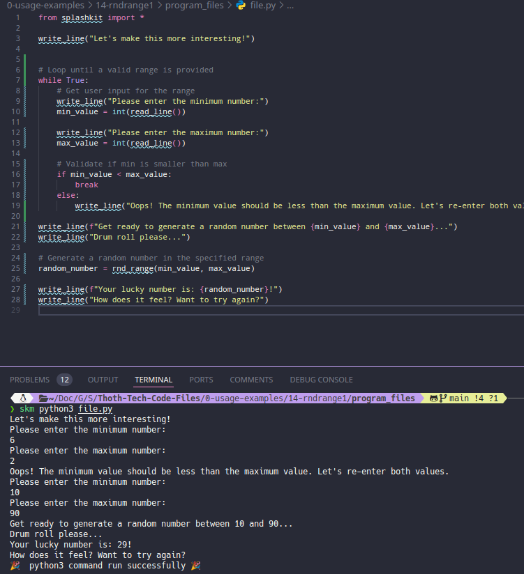
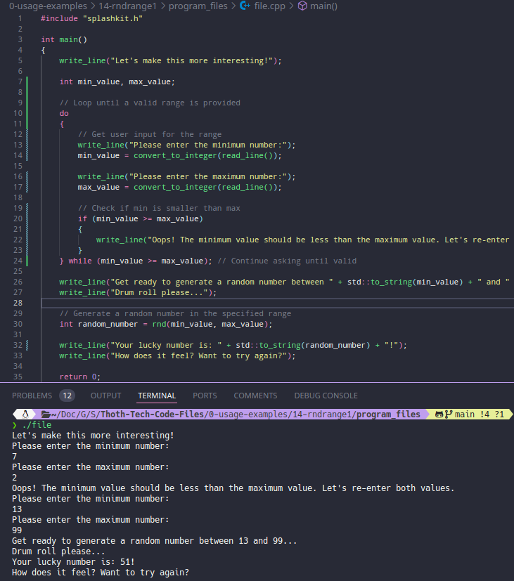
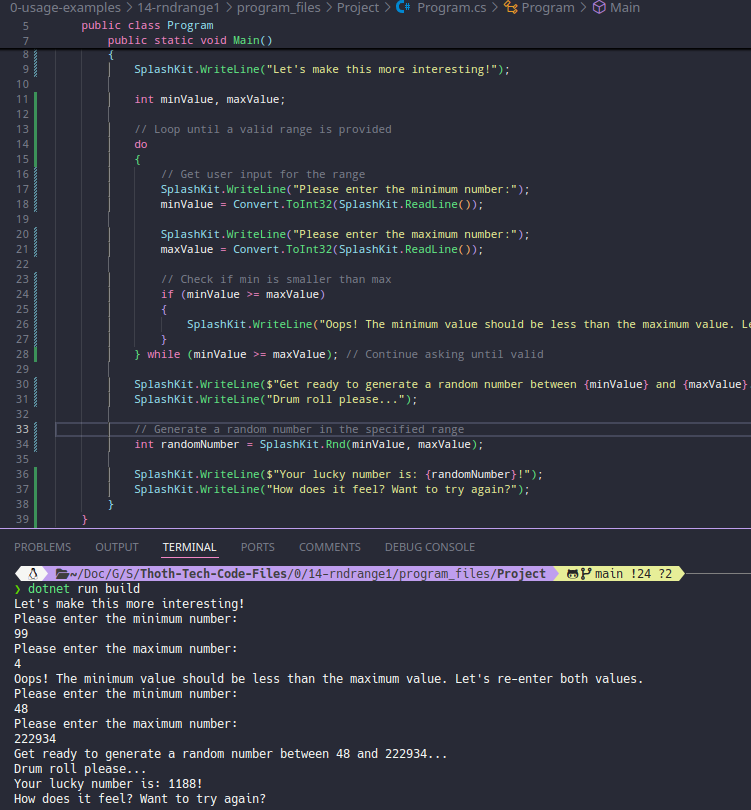
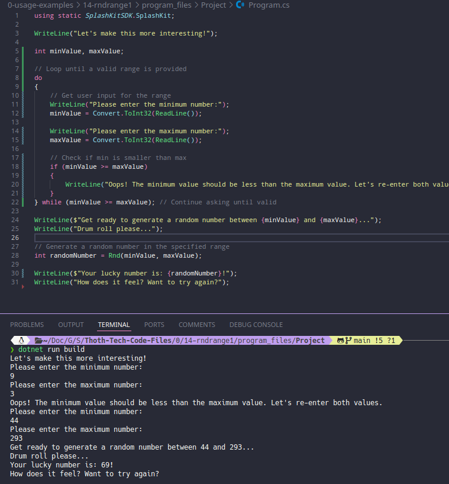

# Usage example creation for Random Number Generation in Range

This is a usage example for generating a random number within a user-defined range using SplashKit. The program prompts the user to enter a minimum and maximum value, then generates and displays a random number within that range. The PR is [here](https://github.com/thoth-tech/splashkit.io-starlight/pull/999)

## Testing Python Code

## Testing the C++ Code

## Testing the C# Code

### OOP Version

### Top Level Version

## Preview of the Site

