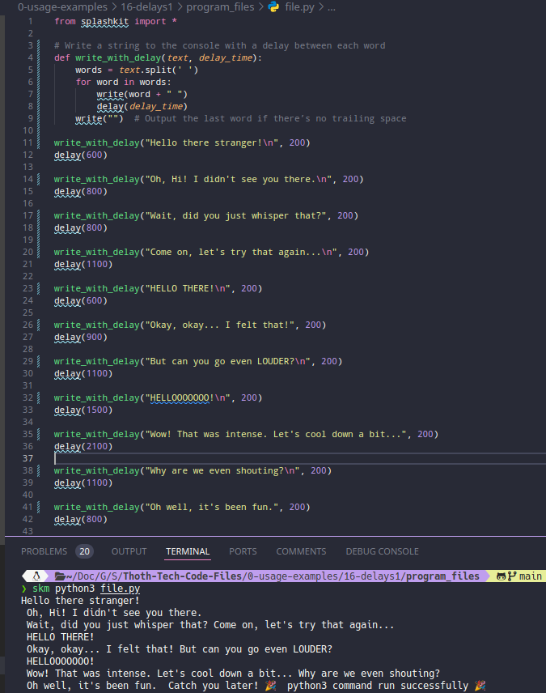

# Usage example creation for Timed Conversation

This is a usage example for simulating a timed conversation using SplashKit in C++. The program displays a series of messages with varying delays to create an interactive dialogue effect. The PR is [here](https://github.com/thoth-tech/splashkit.io-starlight/pull/999)

## Testing Python Code

## Testing the C++ Code

## Testing the C# Code

## Preview of the Site

