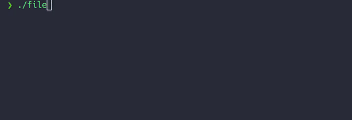
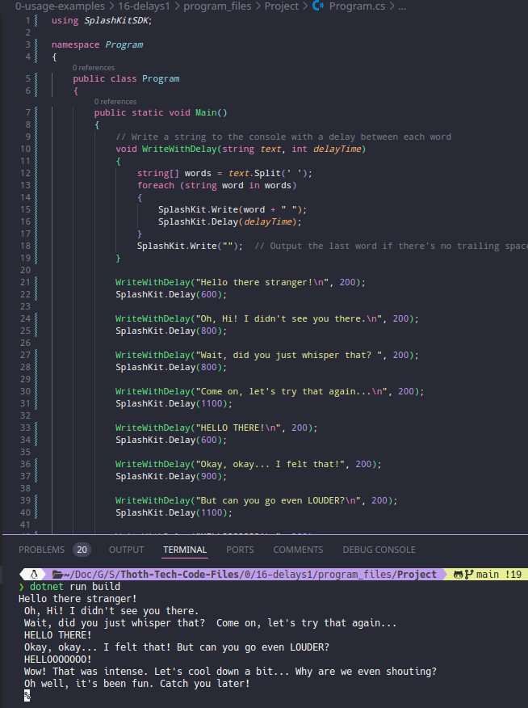
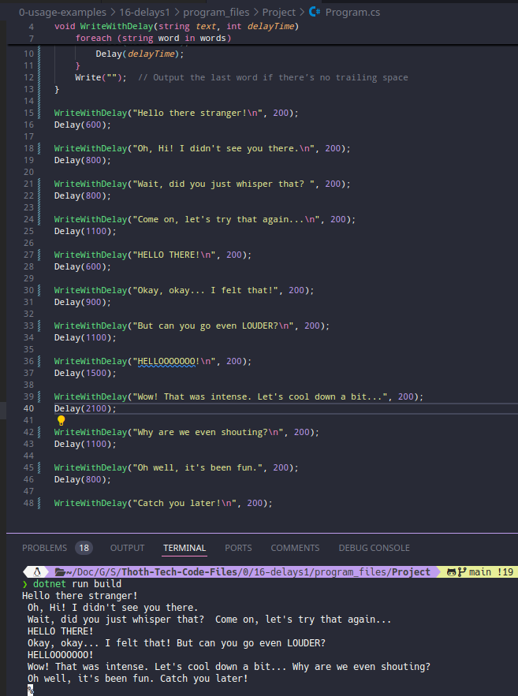

# Usage example creation for Delayed Text Output

This is a fun usage example demonstrating delayed text output using SplashKit. The program prints a conversation-style text with varying delays between each message, making the interaction feel more dynamic. The PR is [here](https://github.com/thoth-tech/splashkit.io-starlight/pull/999)

## Program Running

## Testing Python Code

## Testing the C++ Code

## Testing the C# Code

### OOP Version

### Top Level Version

## Preview of the Site

