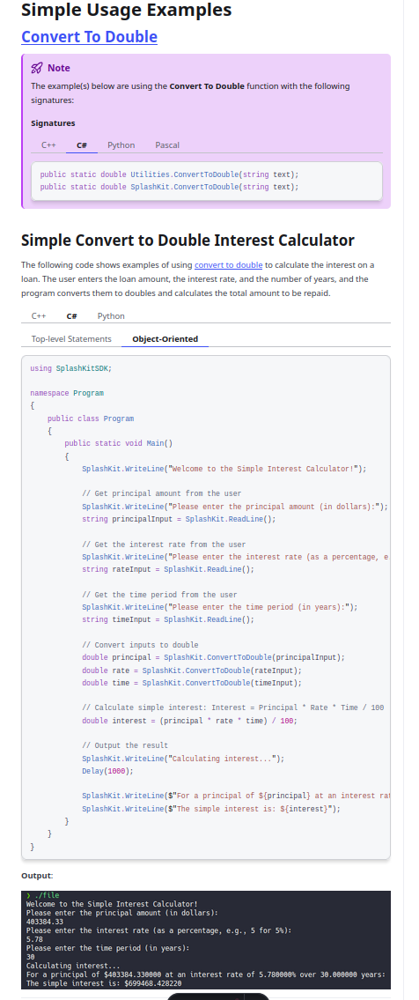

# Usage example creation for Convert to Double

This is a usage example for converting a string to a double using SplashKit. The program takes user input for a number as a string, converts it to a double, and then displays the result. The PR is [here](https://github.com/thoth-tech/splashkit.io-starlight/pull/999)

## Testing Python Code

## Testing the C++ Code

## Testing the C# Code

### OOP Version

### Top Level Version

## Preview of the Site

