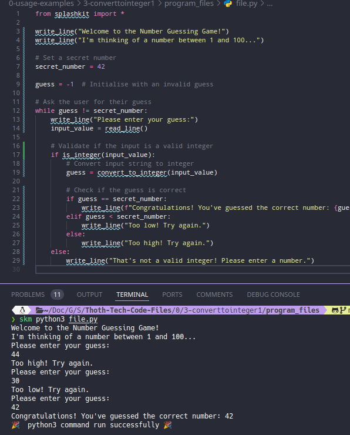
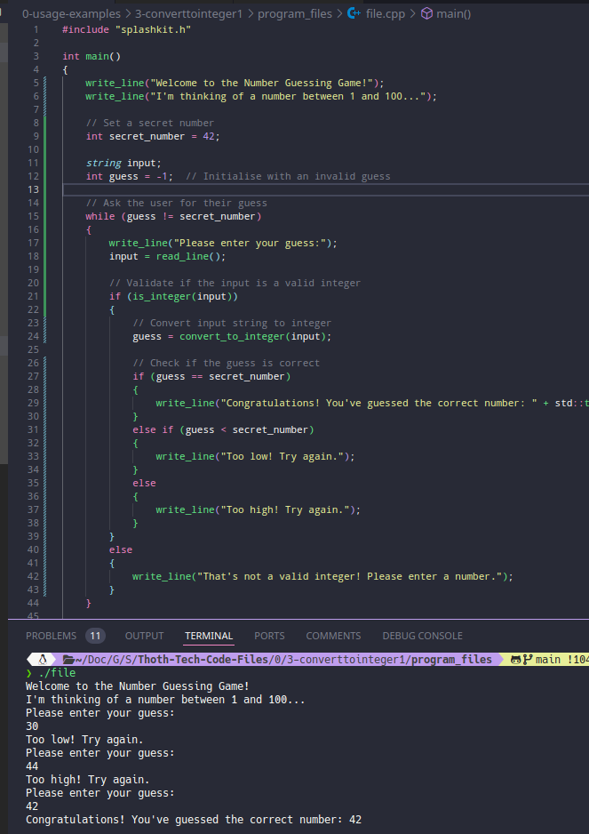
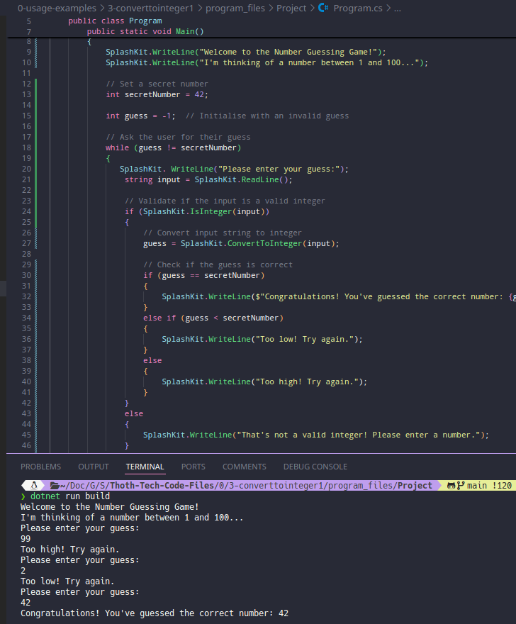
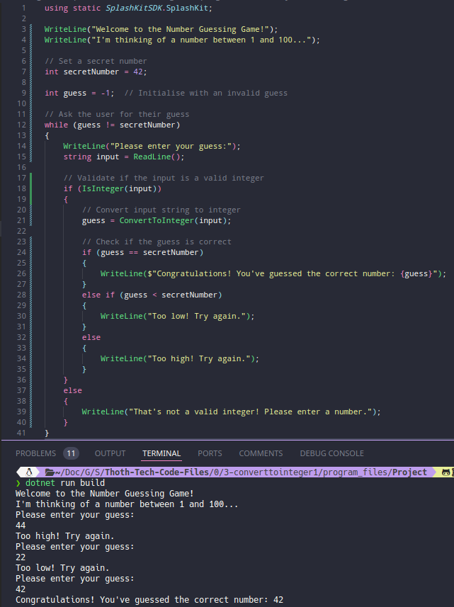
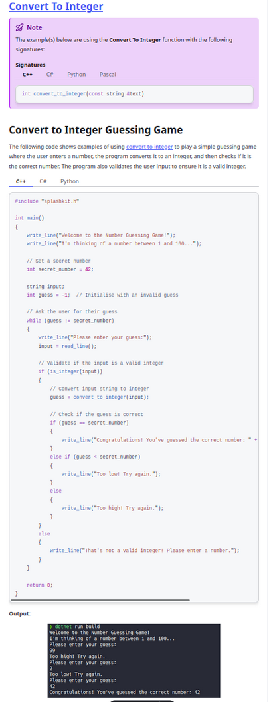

# Usage example creation for Odd or Even Check

This is a usage example for determining if a number is odd or even using SplashKit. The program prompts the user to enter a number, converts the input from a string to an integer, and checks whether the number is odd or even. The PR is [here](https://github.com/thoth-tech/splashkit.io-starlight/pull/999)

## Testing Python Code

## Testing the C++ Code

## Testing the C# Code

### OOP Version

### Top Level Version

## Preview of the Site

