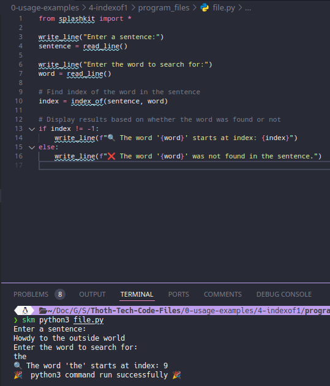
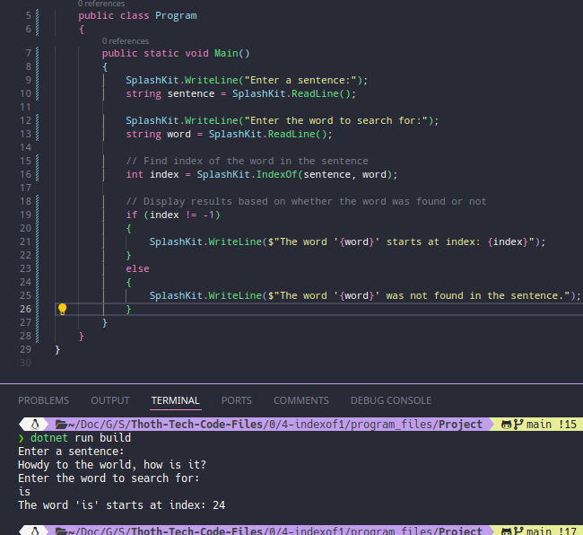
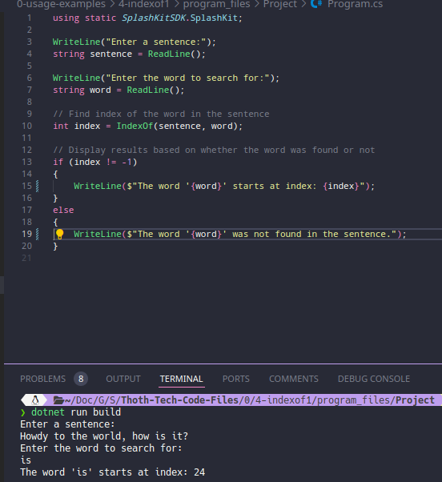
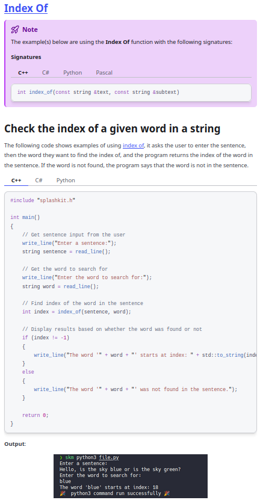

# Usage example creation for Word Search in Sentence

This is a usage example for searching for a word within a sentence and displaying its starting index using SplashKit in C#. The program asks for a sentence and a word to search for, then either displays the starting index of the word or indicates that the word was not found. The PR is [here](https://github.com/thoth-tech/splashkit.io-starlight/pull/999)

## Testing Python Code

## Testing the C++ Code

## Testing the C# Code

### OOP Version

### Top Level Version

## Preview of the Site

