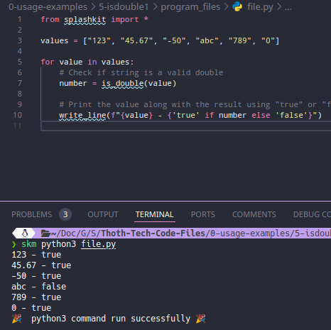

# Usage example creation for String Validation as Double

This is a usage example for verifying if given strings can be parsed as doubles using SplashKit. The program checks a list of strings and prints each along with a result indicating whether it is a valid double or not. The PR is [here](https://github.com/thoth-tech/splashkit.io-starlight/pull/999)

## Testing Python Code

## Testing the C++ Code

## Testing the C# Code

### OOP Version

### Top Level Version

## Preview of the Site

