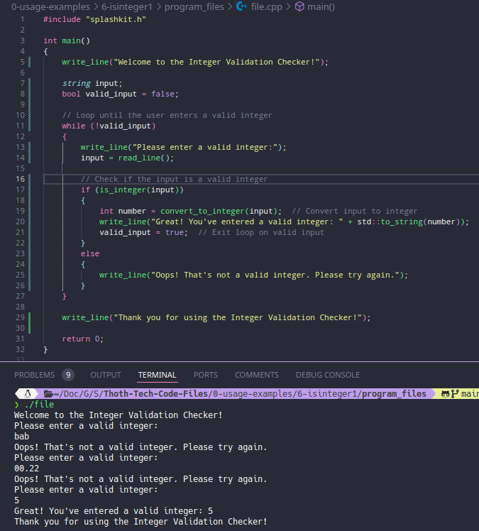
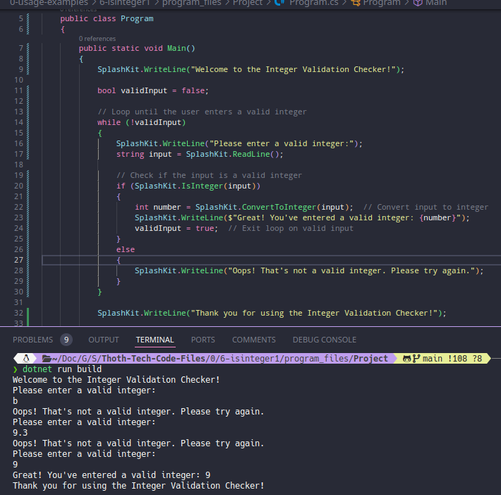
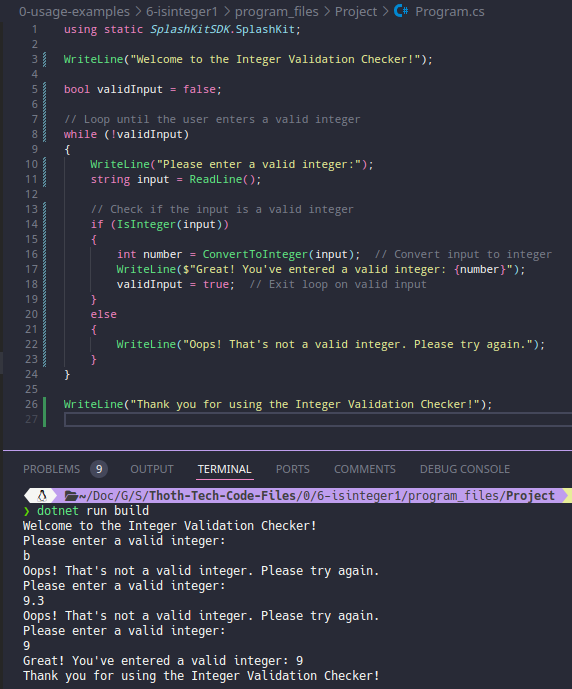

# Usage example creation for Valid Integer Check

This is a usage example for validating whether strings represent valid integer values using SplashKit. The program asks the user to enter a string, and then checks if the string represents a valid integer. If the string is a valid integer, the program prints the integer value; otherwise, it prints an error message, prompting the user to enter a valid integer. The PR is [here](https://github.com/thoth-tech/splashkit.io-starlight/pull/999)

## Testing Python Code

## Testing the C++ Code

## Testing the C# Code

### OOP Version

### Top Level Version

## Preview of the Site

