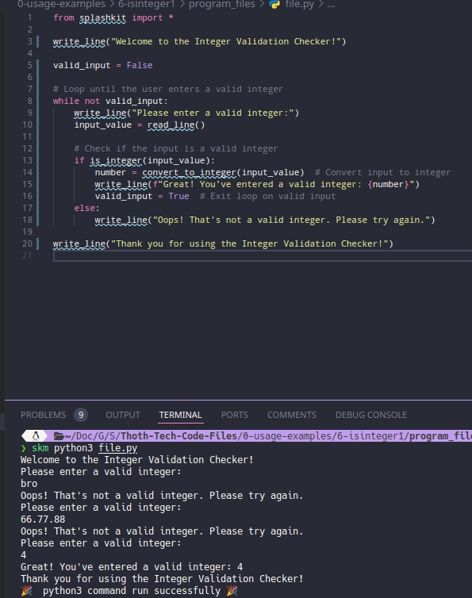

# Usage example creation for Valid Integer Check

This is a usage example for validating whether strings represent valid integer values using SplashKit. The program tests an array of string values and outputs whether each one can be interpreted as an integer. The PR is [here](https://github.com/thoth-tech/splashkit.io-starlight/pull/999)

## Testing Python Code

## Testing the C++ Code

## Testing the C# Code

### OOP Version

### Top Level Version

## Preview of the Site

