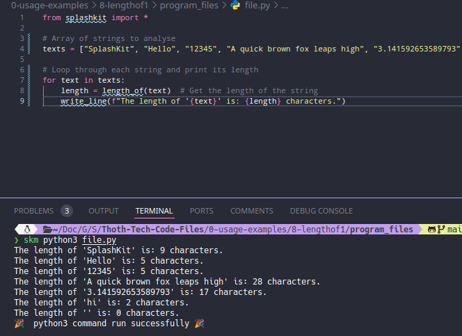
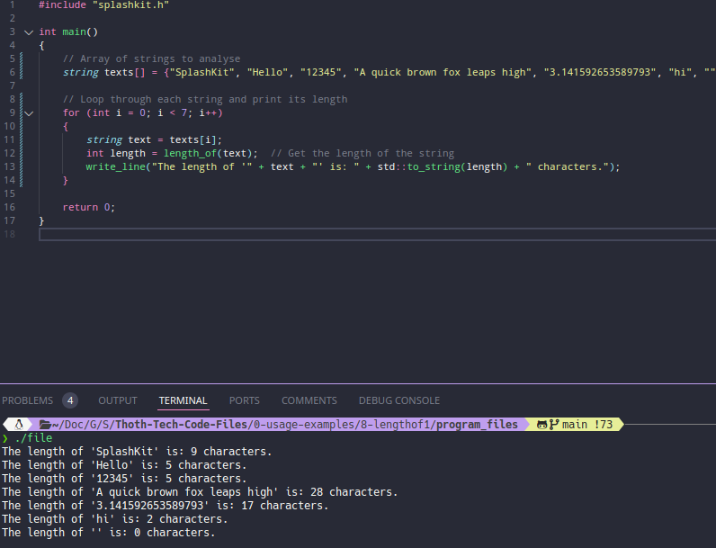
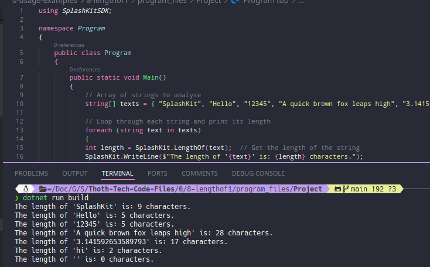
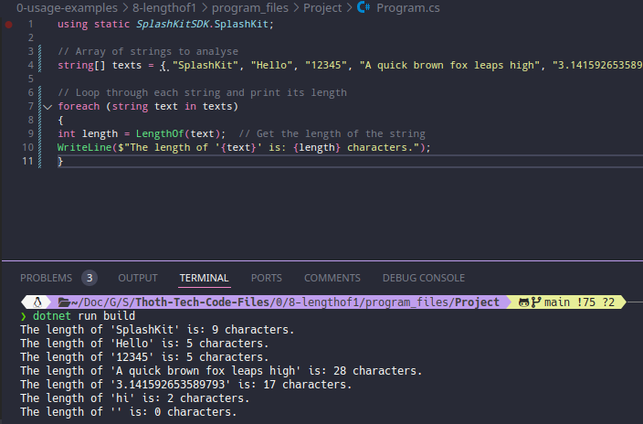

# Usage example creation for String Length

This is a usage example for determining the length of a string using SplashKit. This usage example checks the length of a bunch of strings given. The PR is [here](https://github.com/thoth-tech/splashkit.io-starlight/pull/999)

## Testing Python Code

## Testing the C++ Code

## Testing the C# Code

### OOP Version

### Top Level Version

## Preview of the Site

