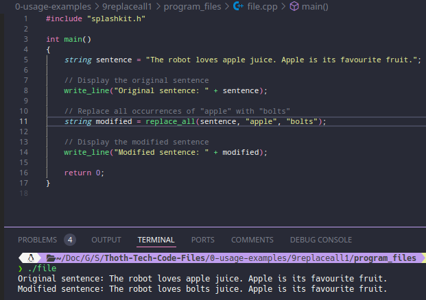

# Usage example creation for Replace All Occurrences in String

This is a usage example for replacing all occurrences of a specified substring within a string using SplashKit. The program takes a sentence and replaces all instances of "apple" with "bolts". The PR is [here](https://github.com/thoth-tech/splashkit.io-starlight/pull/999)

## Testing Python Code

## Testing the C++ Code

## Testing the C# Code

## Preview of the Site

