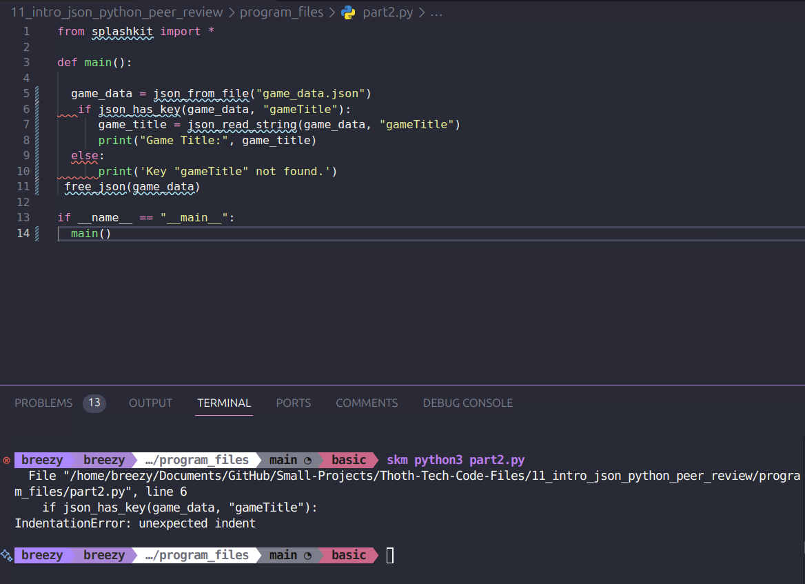

# Peer Review Code Testing

I did a peer review for the pull request found here [here](https://github.com/thoth-tech/splashkit.io-starlight/pull/173), there was a few issues with the actual PR due to the fact it had old files from a prior PR they worked on. So I mentioned this needed to be fixed, but carried out the review of the actual page they were updating anyways so they could fix the issues with the PR and the actual page at the same time.

This PR was to add in python code blocks to the Introduction to JSON tutorial. During reviewing this, I also discovered that the PR they were submitting had the C# code missing from the PR, so I mentioned this to them so they could fix it.

## Code Tests

### Code Part 1

There was an indentation error that needed to be fixed.

After this was fixed, the code ran correctly.

### Code Part 2

There was also an indentation error that needed to be fixed.

After this was fixed, the code ran correctly.

## Review of the Page and Suggested Fix

When reviewing the page I noted the structure of how they show the build commands didn't come across well:

So I opened up my local environment to try create an example that would look nicer:

