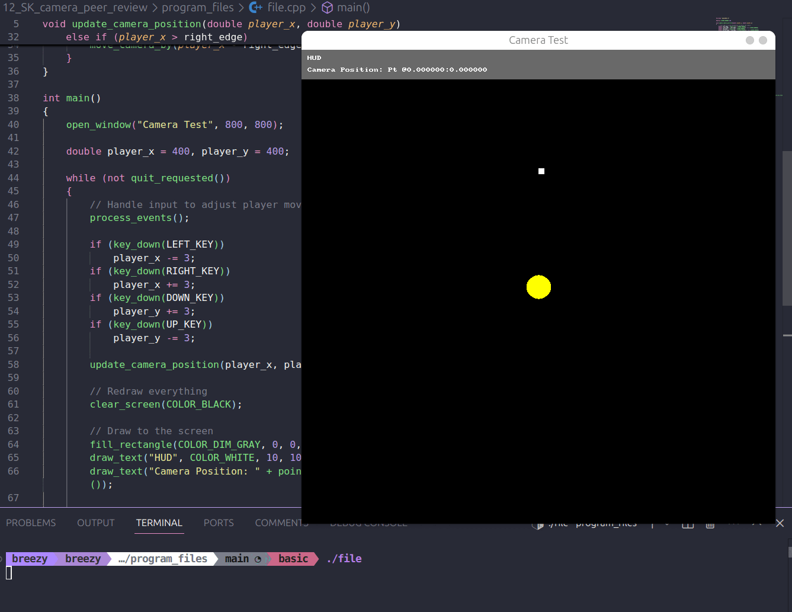
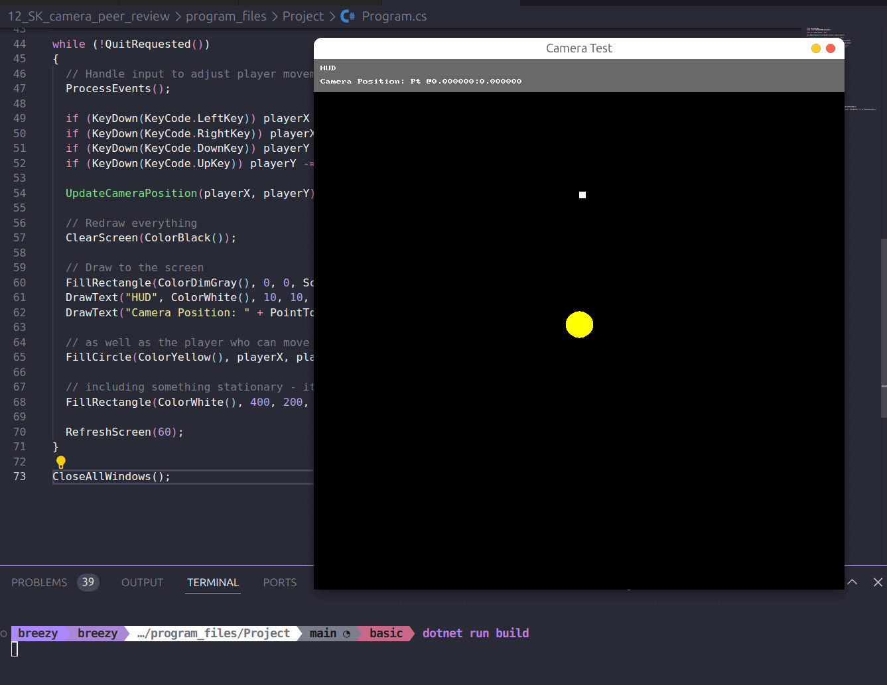
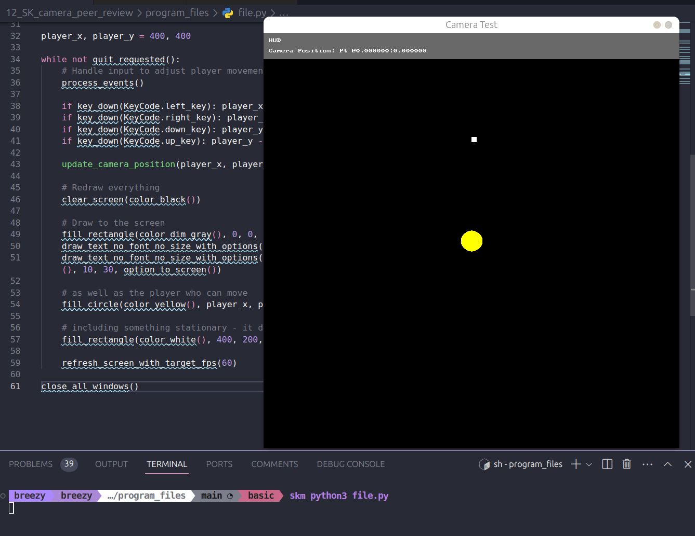

# Peer Review Code Testing

I did a peer review for the pull request found here [here](https://github.com/thoth-tech/splashkit.io-starlight/pull/164), I reviewed the program code and the updated spelling in the review. As well as the documentation file found here [here](https://github.com/thoth-tech/documentation/pull/545).

## Code Testing

### C++

### C#

### Python

