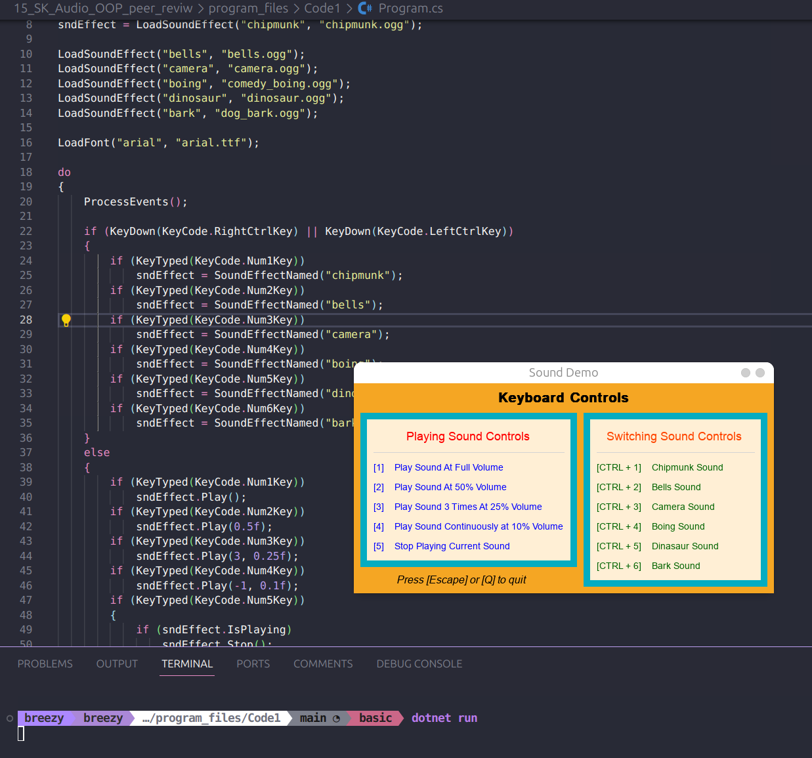
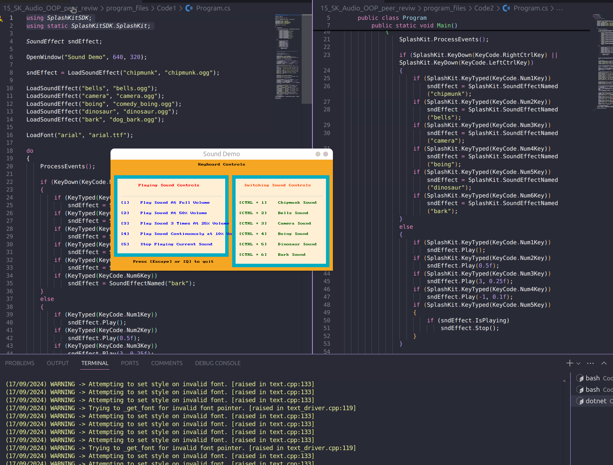
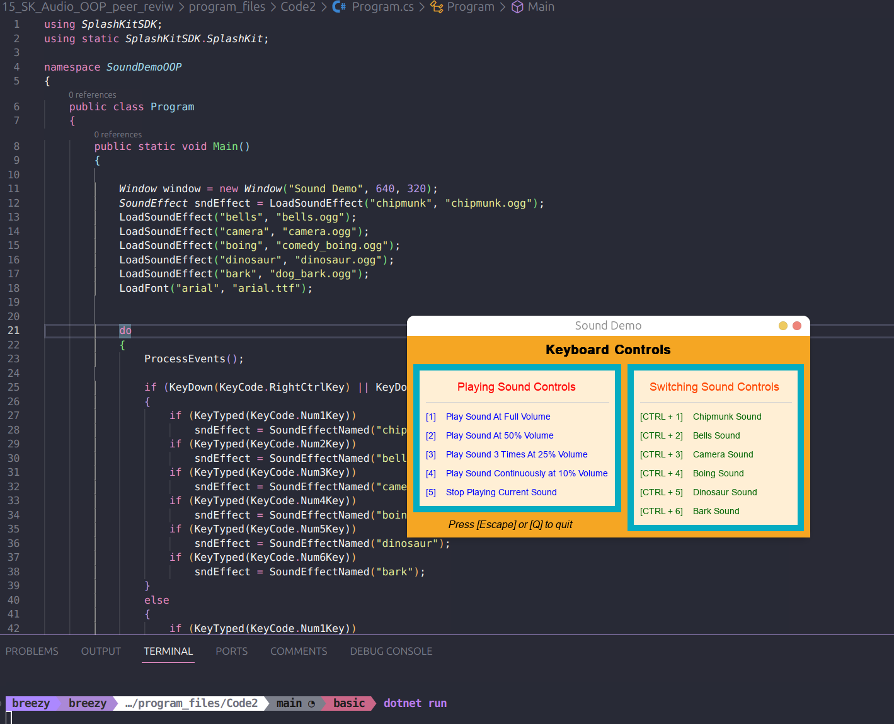

# Peer Review Code Testing

I did a peer review for the pull request found here [here](https://github.com/thoth-tech/splashkit.io-starlight/pull/182), I reviewed the program code and debugged to figure out what the issue was causing the warnings within the terminal. Discovered it was that the line `LoadFont("arial", "arial.ttf");` was missing within the OOP version. Left a comment on the PR to fix this, and also to modify it to do  `using static SplashKitSDK.SplashKit;`.

## Code Testing

### C# Top Level Verson

### C# OOP Version

The issue that needed debugging:

Code now working:

