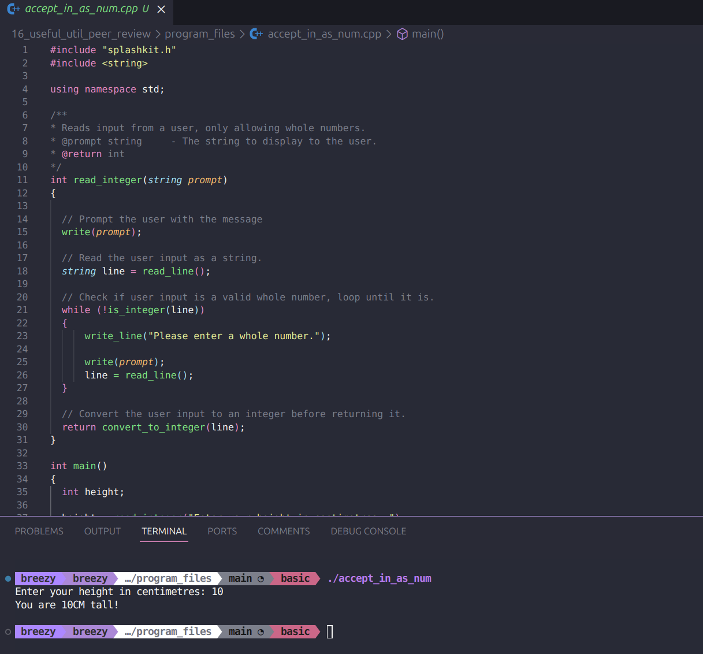

# Peer Review Code Testing

I did a peer review for the pull request found here [here](https://github.com/thoth-tech/splashkit.io-starlight/pull/176), I reviewed all the code files to ensure they worked correctly:

## Code Testing

### Python

### C#

### C++

