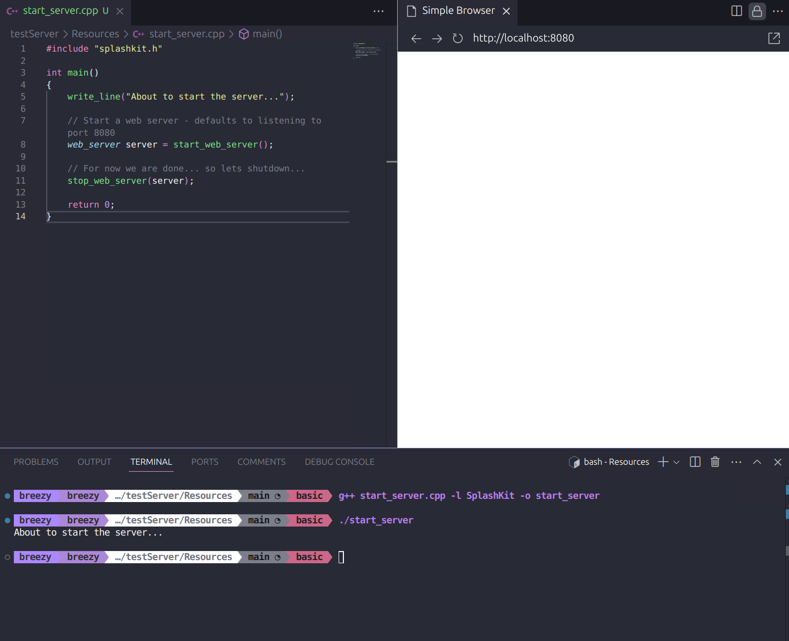
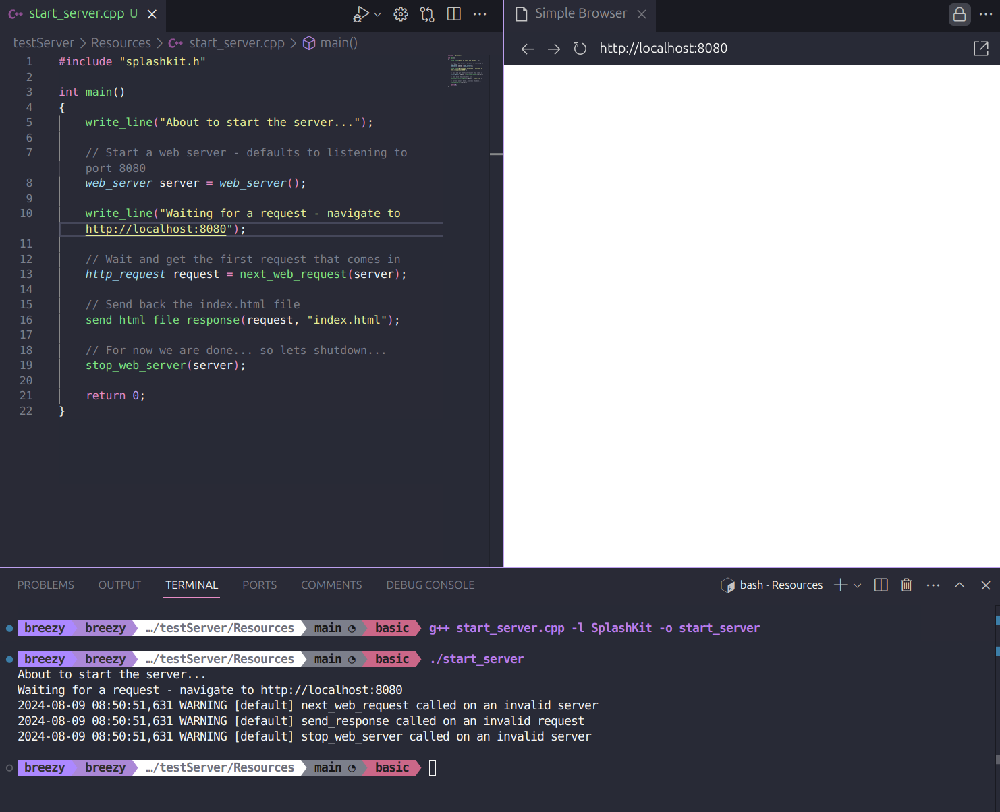
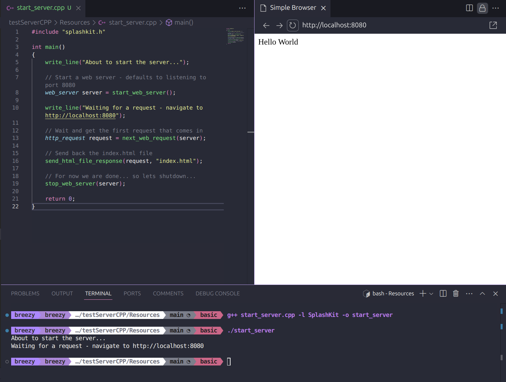
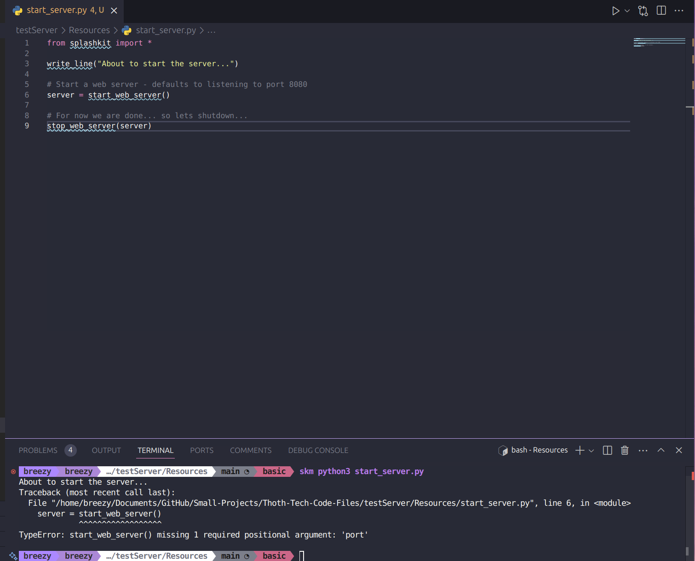
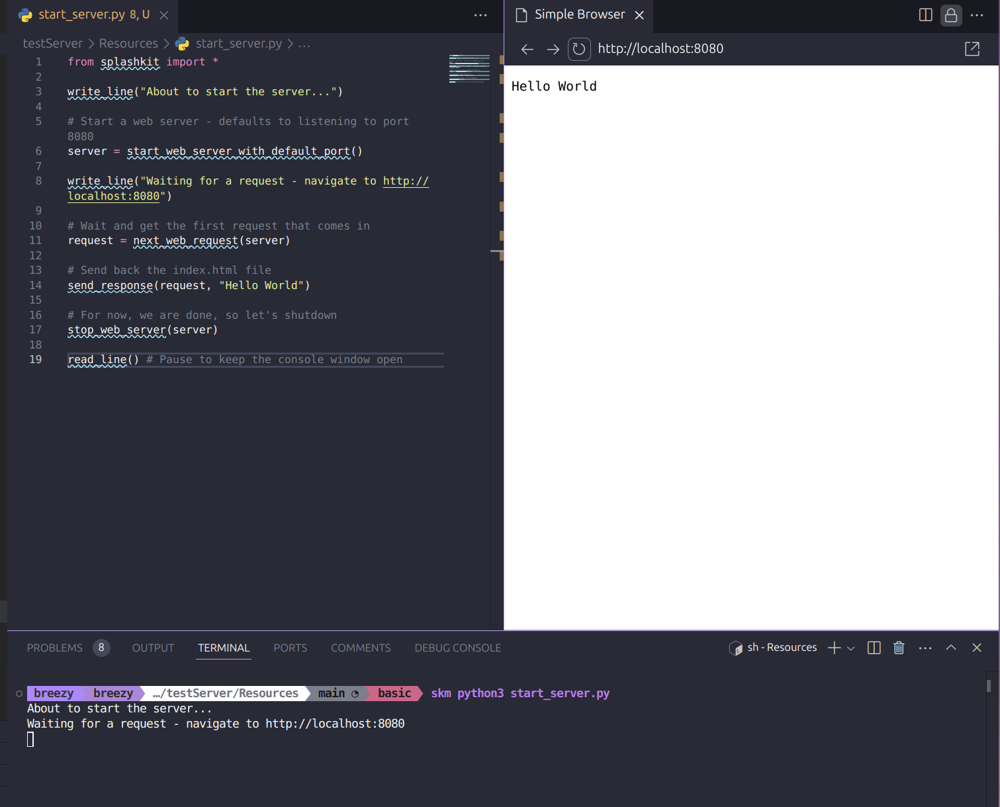
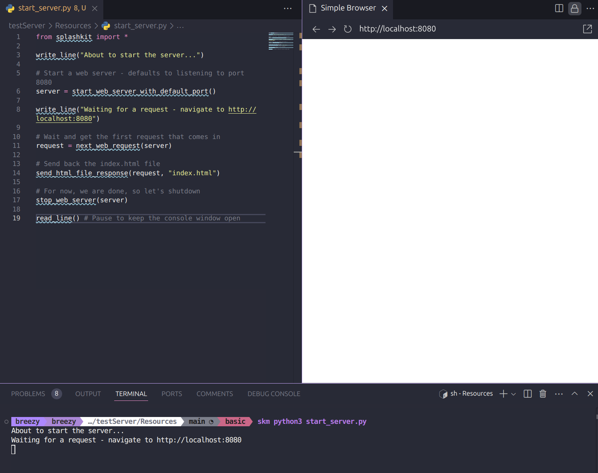
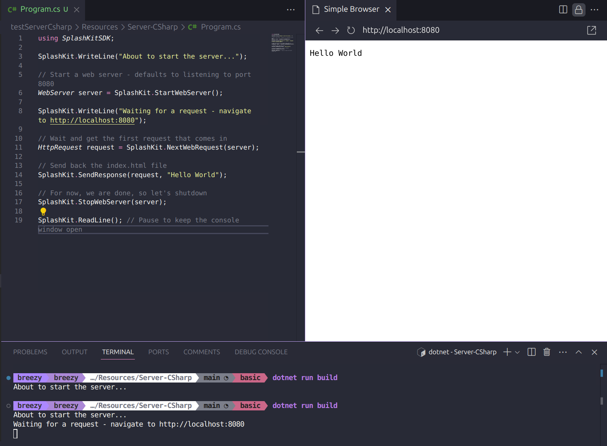
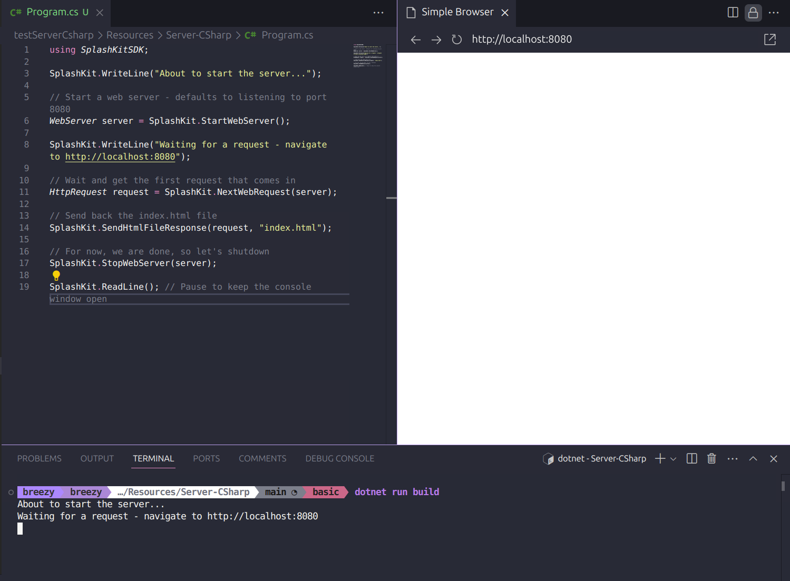

# Code Testing

This folder contains the tutorial review for [Getting Started with Servers](https://splashkit.io/guides/networking/0-getting-started-with-servers/) on the SplashKit website.

The tutorial review covered testing if the code provided in the tutorial works as expected. The code was tested by running the code in the terminal and checking if the output matched the expected output. There was some errors within the C++ Code, specifically in step 3 and step 4 the tutorial used `web_server` when it should've been `start_web_server`. This was fixed and updated in the tutorial on Splashkit.

## Testing C++ Code

### Step 2:



### Step 3:

Error that was received:

```bash
About to start the server...
Waiting for a request - navigate to http://localhost:8080
2024-08-09 18:00:35,112 WARNING [default] next_web_request called on an invalid server
2024-08-09 18:00:35,112 WARNING [default] send_response called on an invalid request
2024-08-09 18:00:35,112 WARNING [default] stop_web_server called on an invalid server
```



After fixing:



### Step 4:


## Testing Python Code

### Step 2:



### Step 3:



### Step 4:



## Testing C# Code

### Step 2:


### Step 3:



### Step 4:

