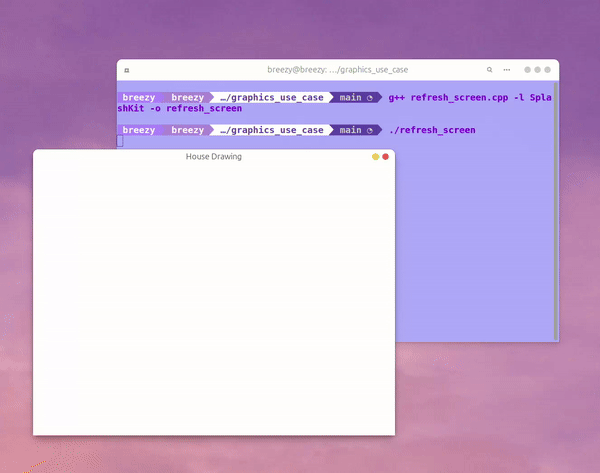
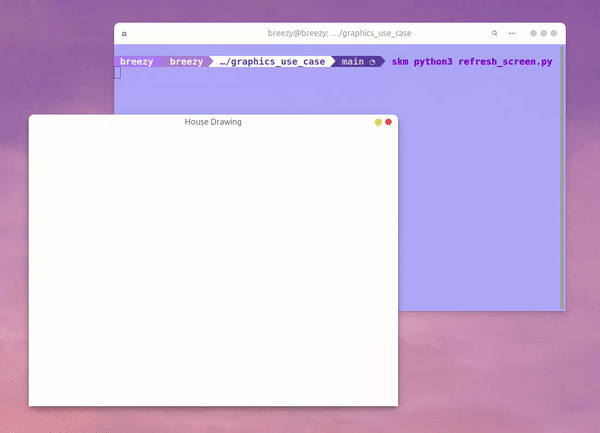
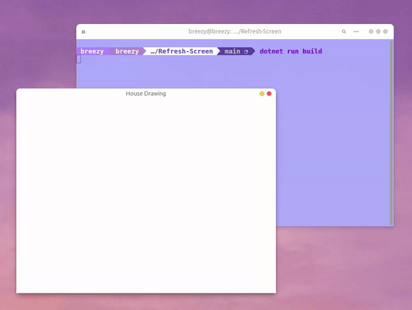

# Code Testing

This folder contains the tutorial review for [Graphics Usage Page](https://splashkit.io/guides/graphics/0-drawing-using-procedures/) on the SplashKit website.

The tutorial review covered testing if the code provided in the tutorial works as expected. The code was tested by running the code in the terminal and checking if the output matched the expected output. In addition, it was noted that python versions were missing so they were created and added to the page on Splashkit.

## Testing C++ Code

## Testing Python Code

## Testing C# Code

