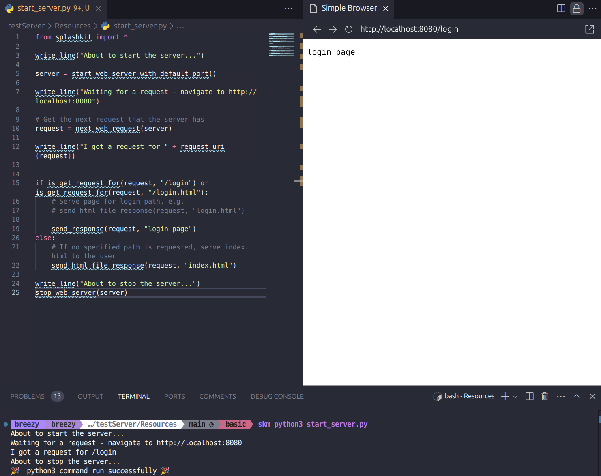

# Code Testing

This folder contains the tutorial review for [Routing With Servers](https://splashkit.io/guides/networking/1-routing-with-servers/) on the SplashKit website.

The tutorial review covered testing if the code provided in the tutorial works as expected. The code was tested by running the code in the terminal and checking if the output matched the expected output. There was one error within the C++ Code, specifically in in the recap section where it used `web_server` when it should've been `start_web_server`. This was fixed and updated in the tutorial on Splashkit. 

In addition the checking requests C# code used static void main and program class so this was modified to use top level only code.

## Testing C++ Code

### Checking Requests

### Handling Requests

## Testing Python Code

### Checking Requests

### Handling Requests

## Testing C# Code

### Checking Requests

### Handling Requests

