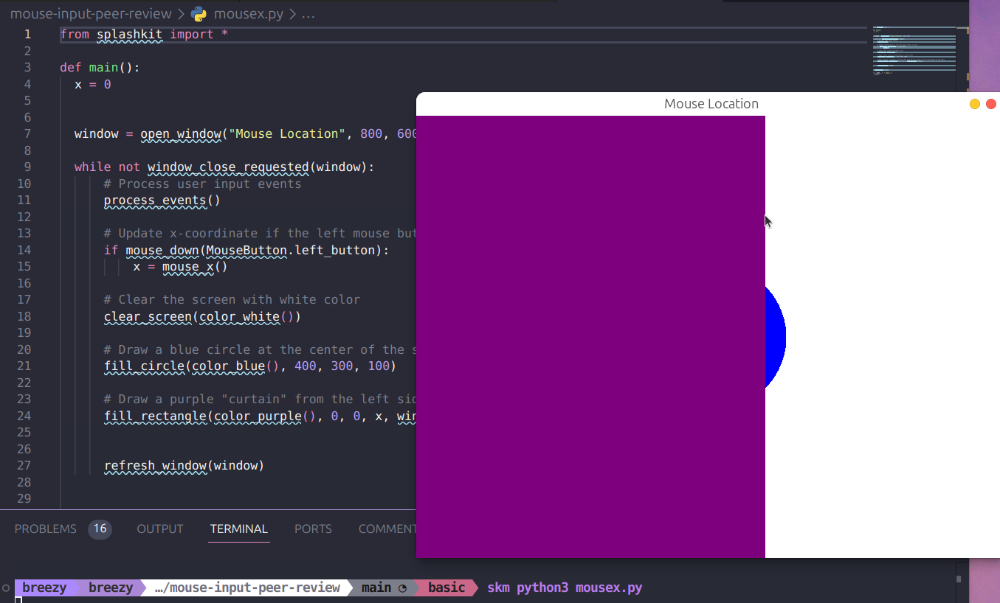

# Peer Review Code Testing

I did a peer review for Mounika who had added in the python code version for all the mouse input examples under this section: [here](https://splashkit.io/guides/input/1-mouse-button-inputs/) for [this](https://github.com/thoth-tech/splashkit.io-starlight/pull/139) pull request. The following shows each code file and the output of the code when run.

### Mouse Clicked

### Mouse Down

### Mouse Up

### Mouse Movement

### Mouse Wheel Scroll

### Mouse Position

### Mouse Position Vector

### Mouse X

### Mouse Y

### Hide Show Mouse Cursor

### Mouse Cursor

