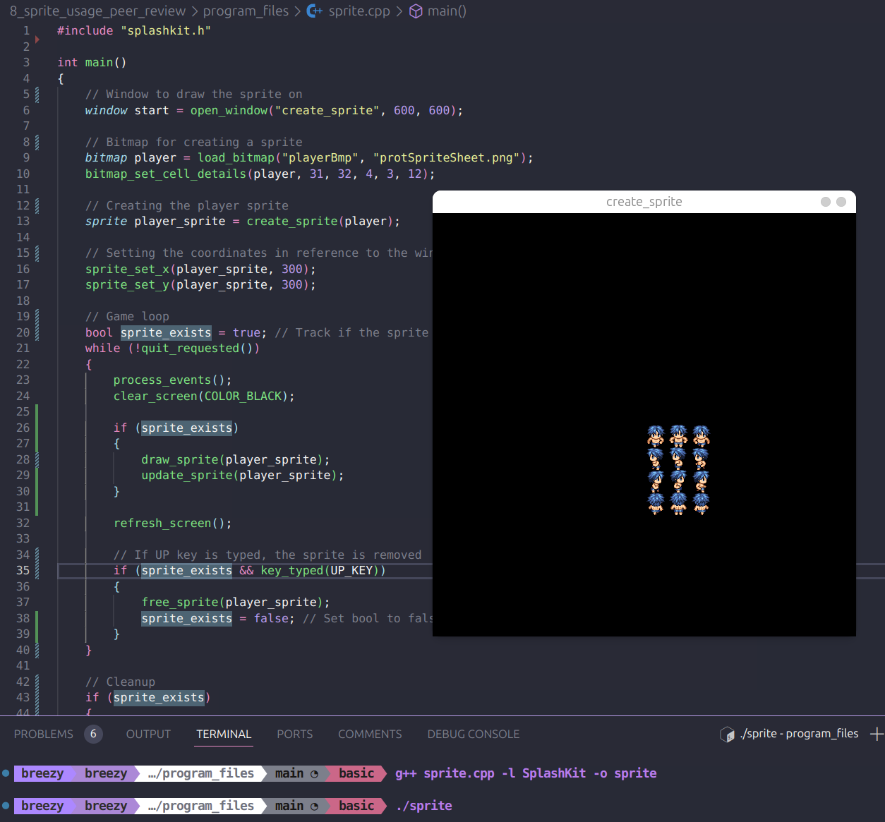
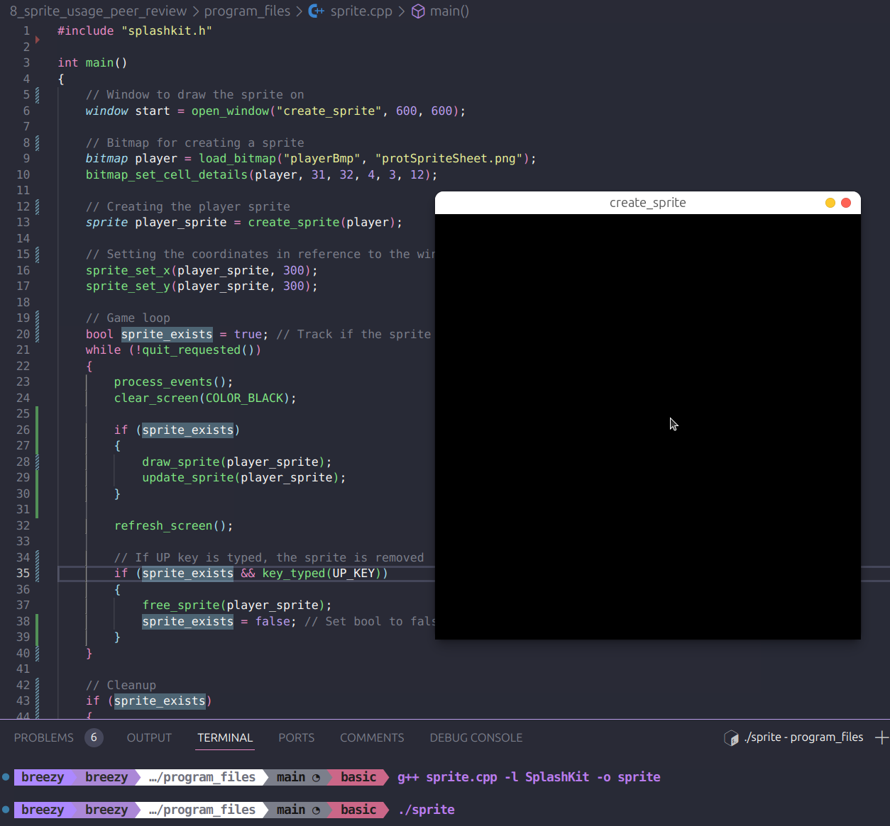
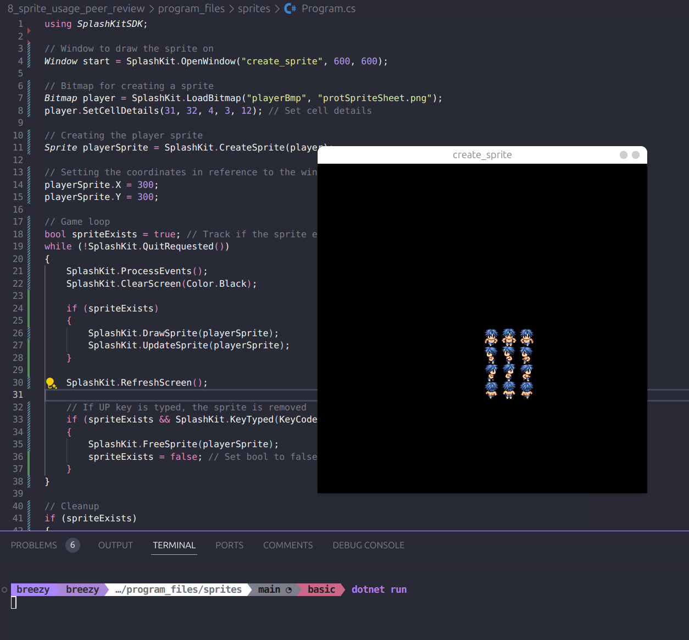
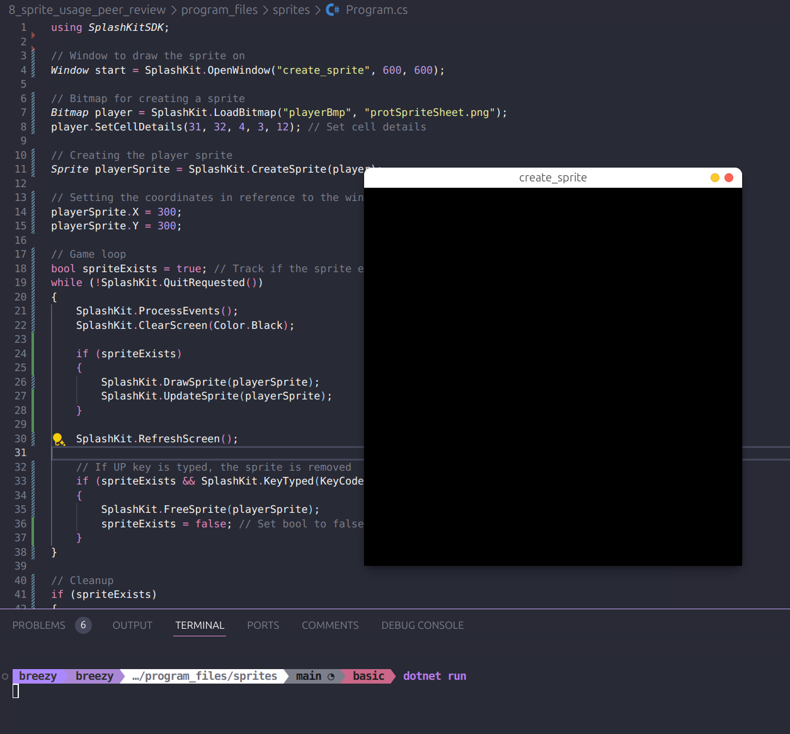

# Peer Review Code Testing

I did a peer review for the pull request found [here](https://github.com/thoth-tech/splashkit.io-starlight/pull/154). I checked the code worked correctly, made comments on missing bitmap png file and not using top level statements fo C#. Then after the changes were made, I needed to do another review request for getting the same bitmap as what their gif they had.

## Code Tests

### C++

### C#

