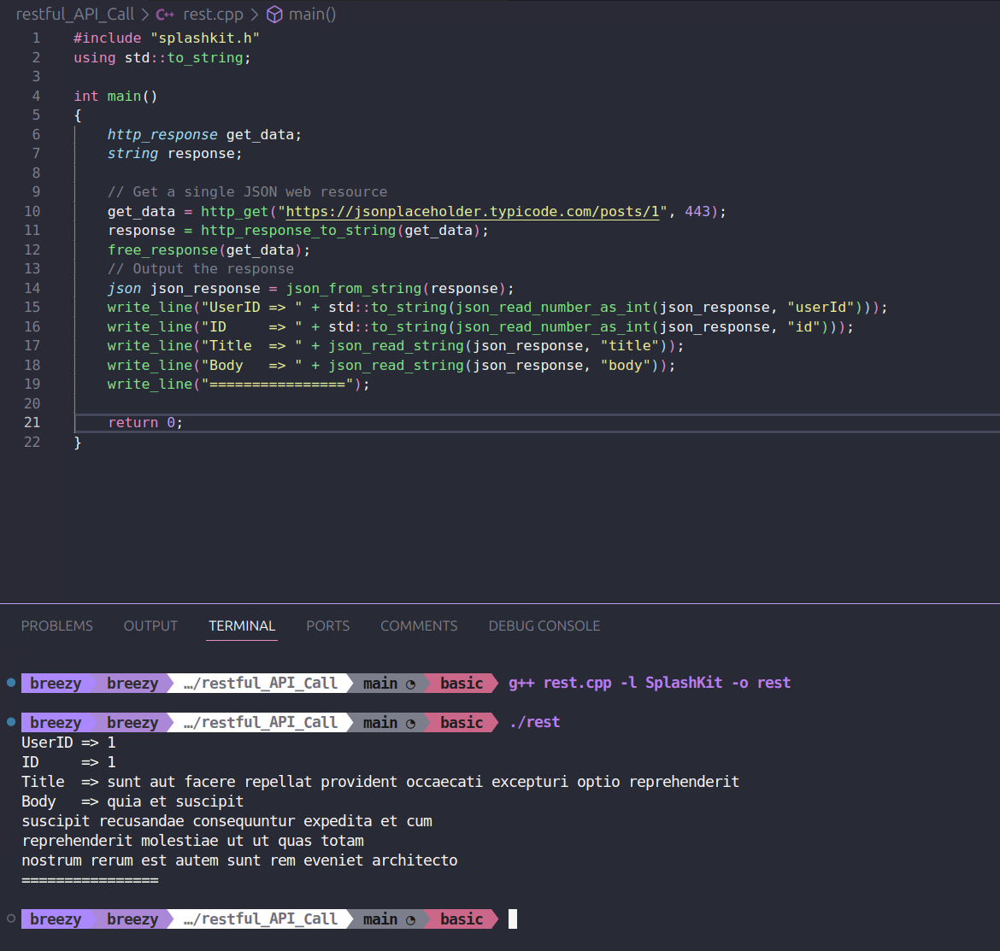
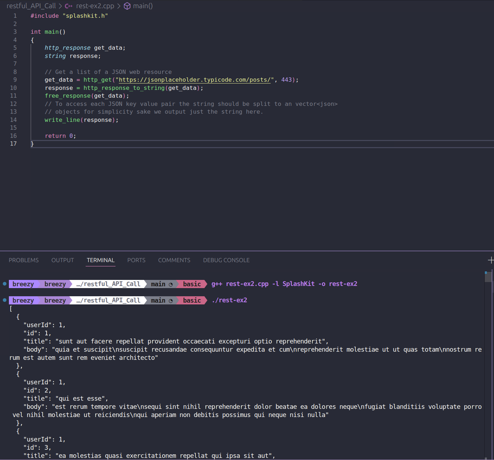
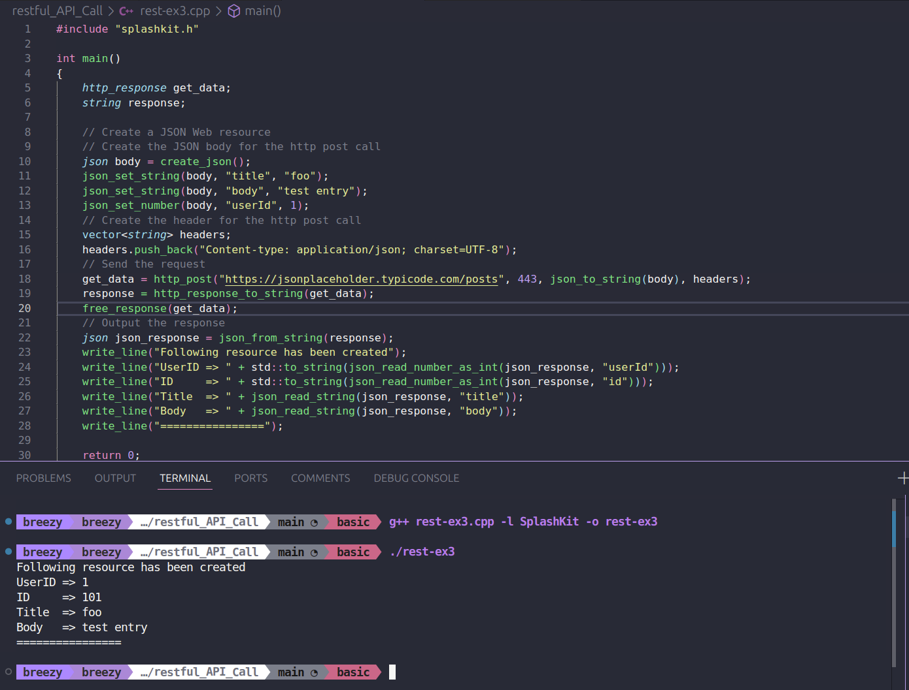
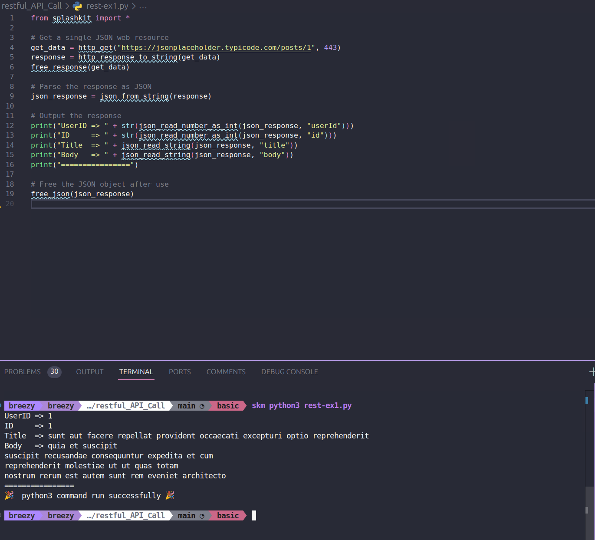
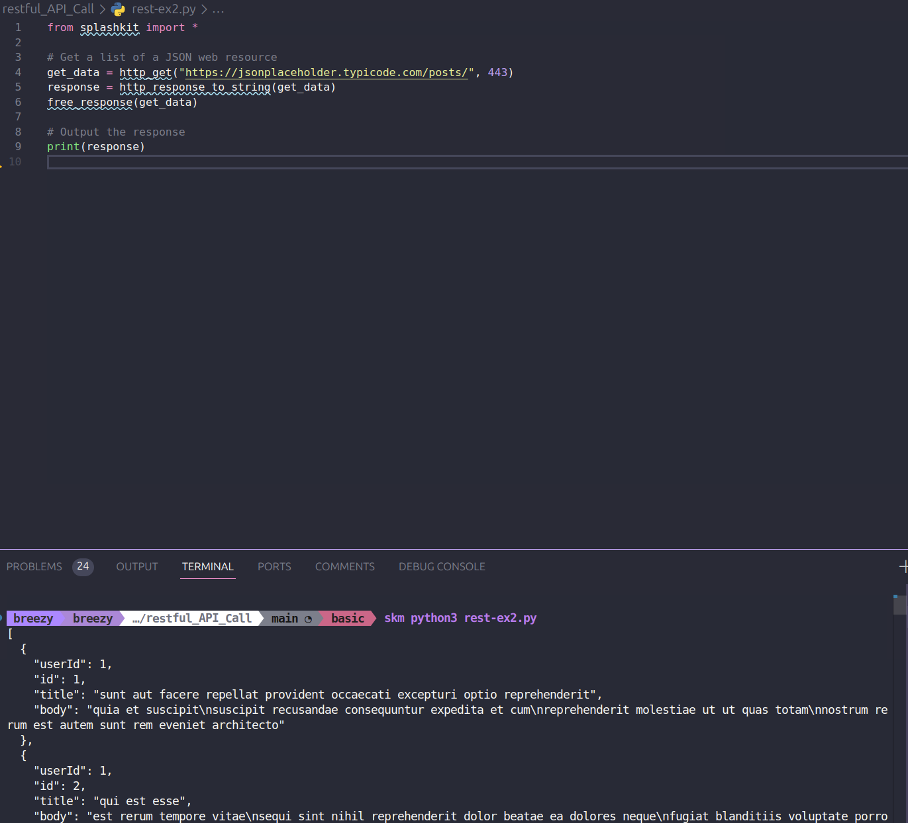
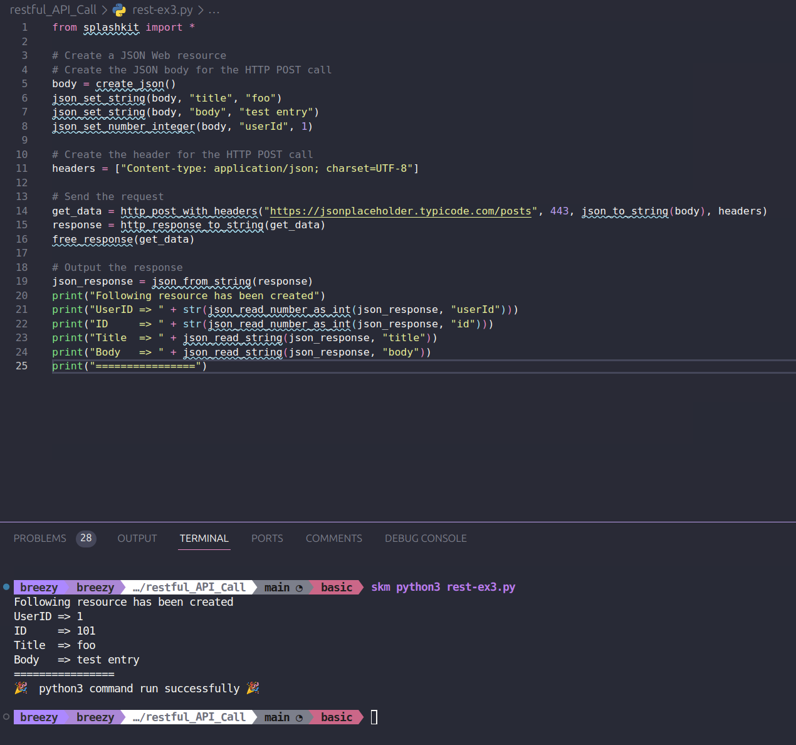
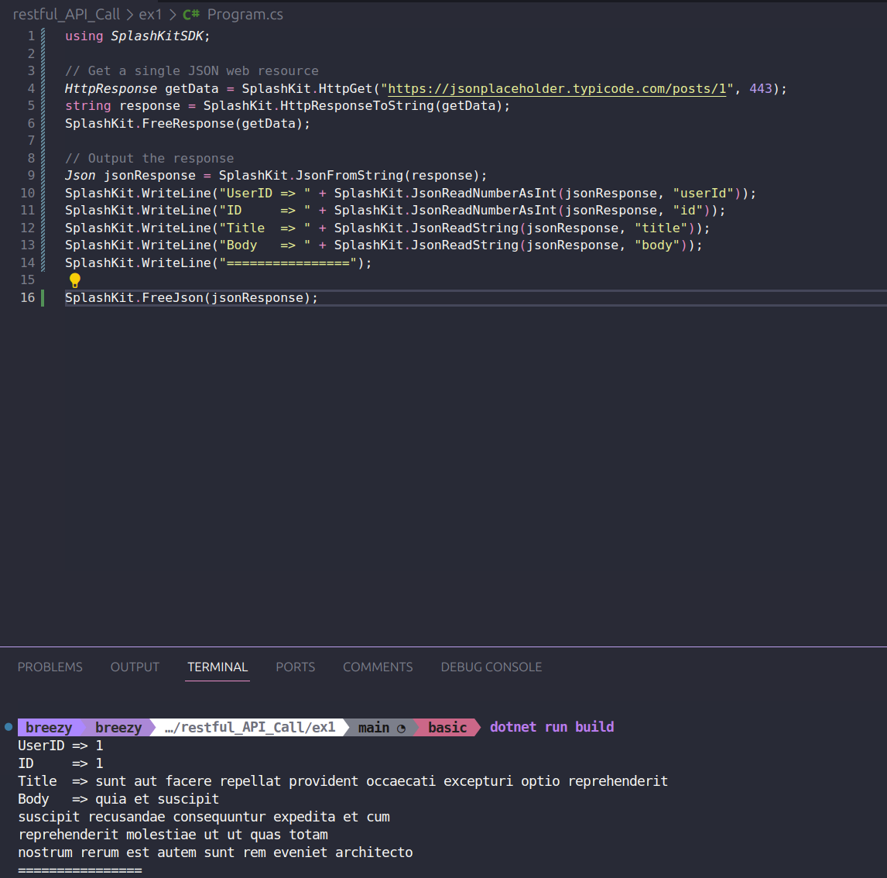
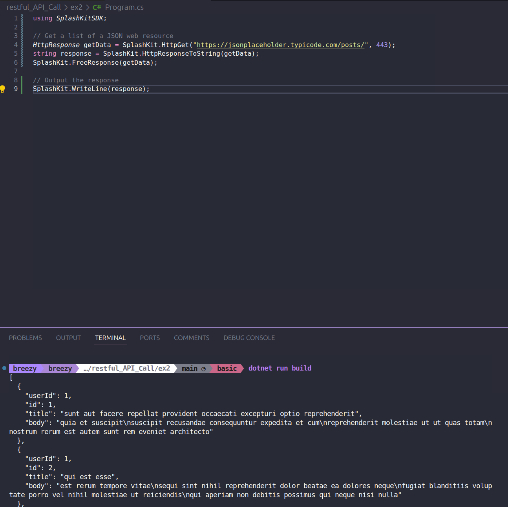
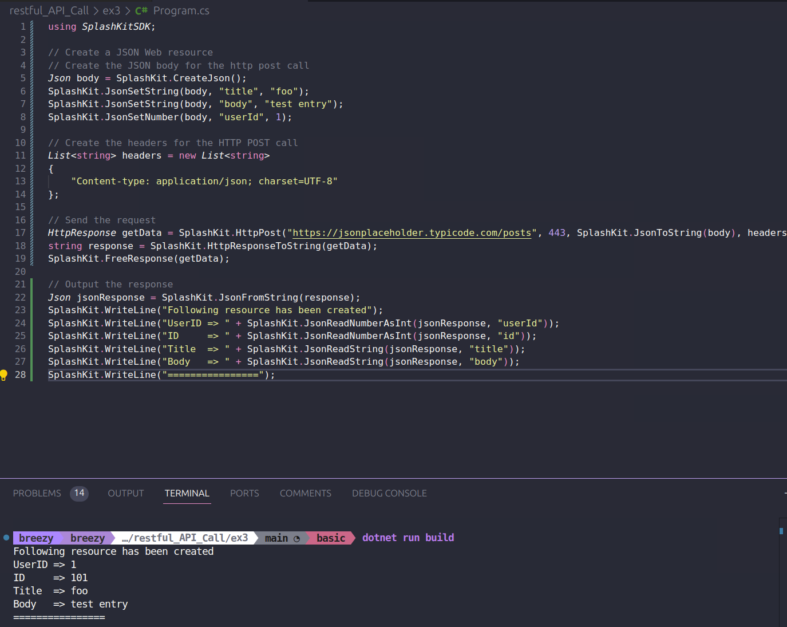

# Code Testing

This folder contains the tutorial review for [Making a RESTful API Call](https://splashkit.io/guides/networking/2-restful-api-call/) on the SplashKit website.

The tutorial review covered testing if the code provided in the tutorial works as expected. This particular tutorial only contained code for C++, so I worked through the tutorial with just the C++ code to review it worked correctly and understood what the purpose of it was. Then I worked through creating a C# version using top level statements only, and a python version. I reviewed all code worked correctly then updated the page.

## Testing C++ Code

### Example 1:

### Example 2:

### Example 3:

## Testing Python Code

### Example 1:

### Example 2:

### Example 3:

## Testing C# Code

### Example 1:

### Example 2:

### Example 3:

