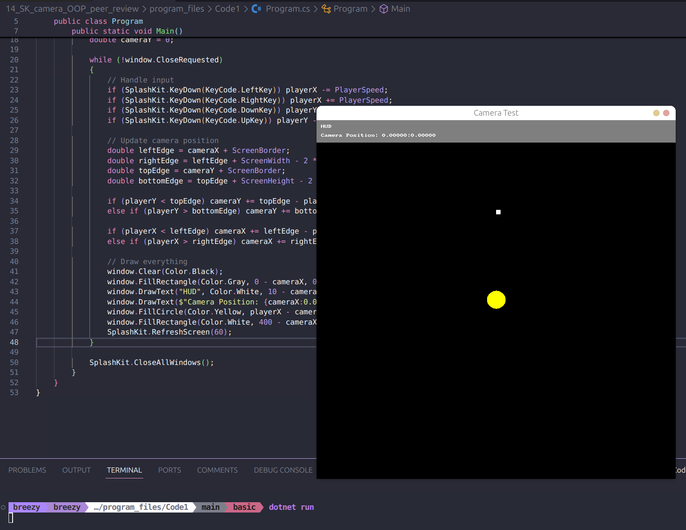
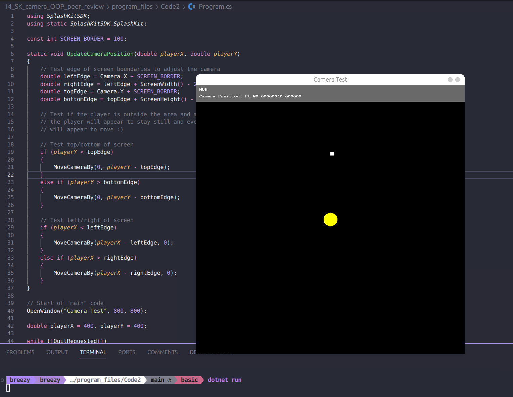

# Peer Review Code Testing

I did a peer review for the pull request found here [here](https://github.com/thoth-tech/splashkit.io-starlight/pull/183), I reviewed the adding in C# OOP code, left a request change on the review so the comments in the code would match with the other code blocks on the specific guide.

Tested both the top level which was unchanged, with the OOP to ensure it runs correctly which it did.

## Code Testing

### C# OOP

### C# Top Level

