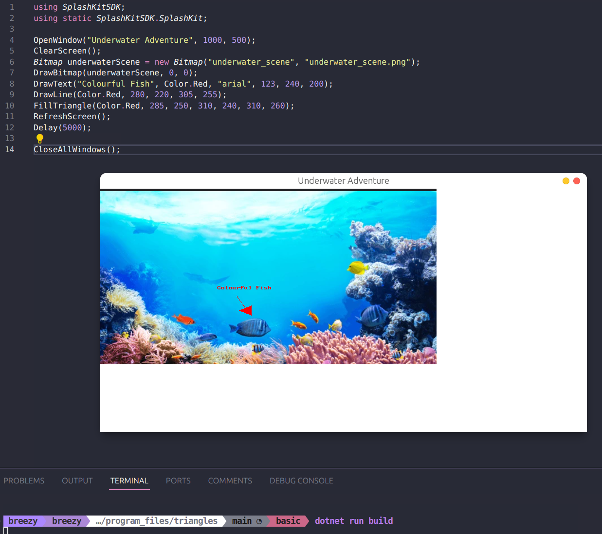
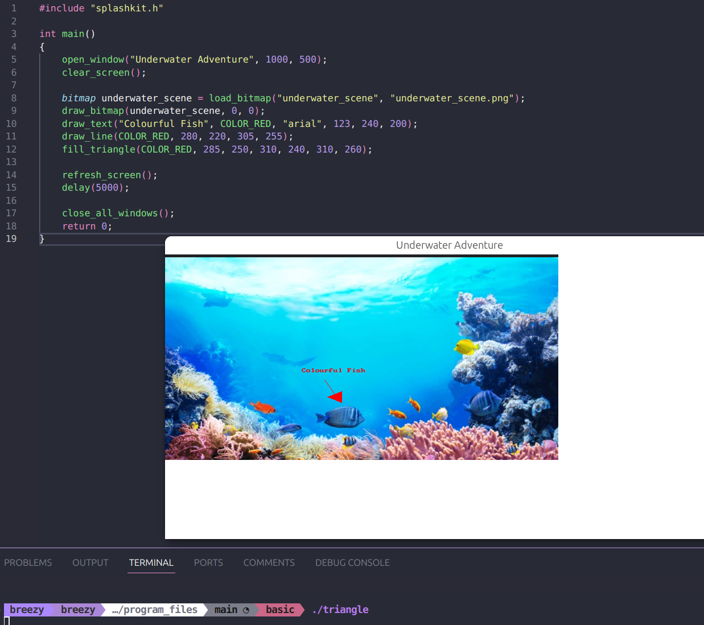
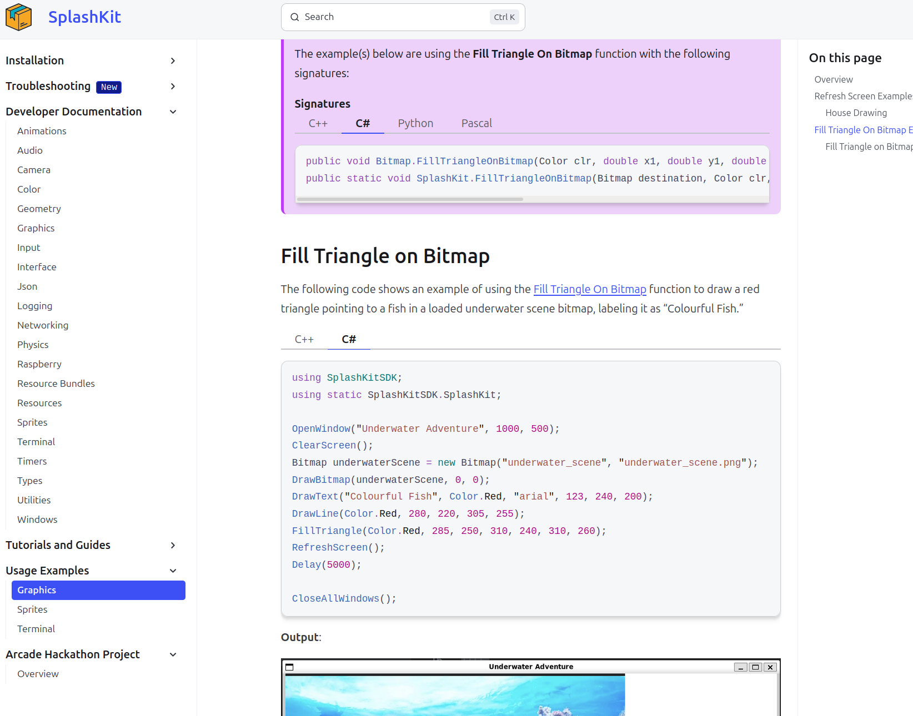

# Peer Review Code Testing

I did a peer review for the pull request found here [here](https://github.com/thoth-tech/splashkit.io-starlight/pull/151). I checked out the PR in my local environment to see how it displays on the Splashkit site as well as reviewed the program code to check it runs correctly.

## Code Tests

### C#

### C++

## Review in Local Environment

