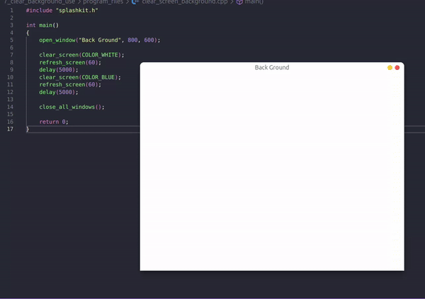
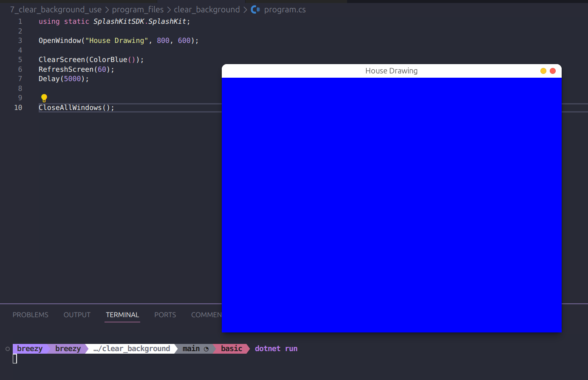
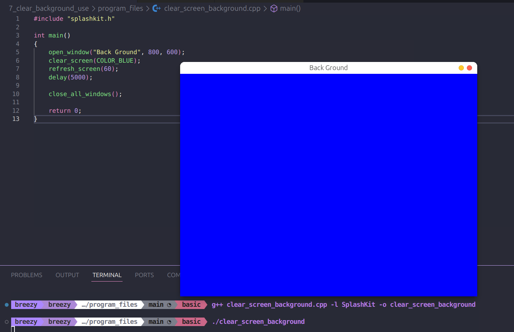

# Peer Review Code Testing

I did a peer review for the pull request found [here](https://github.com/thoth-tech/splashkit.io-starlight/pull/148). I checked that the code worked correctly and that the explanation of the usage guide was clear.

However, I made a recommendation of change for the program code to show the usage example better. The recommendation was to initially have the screen be white, then change to blue to show how the clear screen function can be used to change the background color.

### Demo of the recommended Changes

### Code Tests

