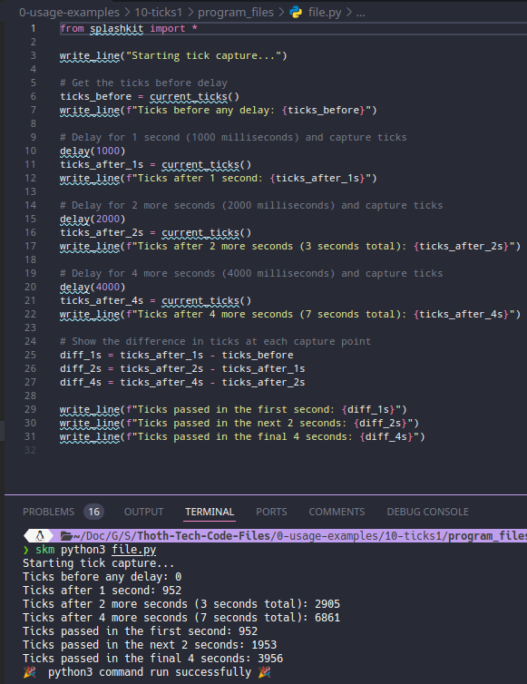
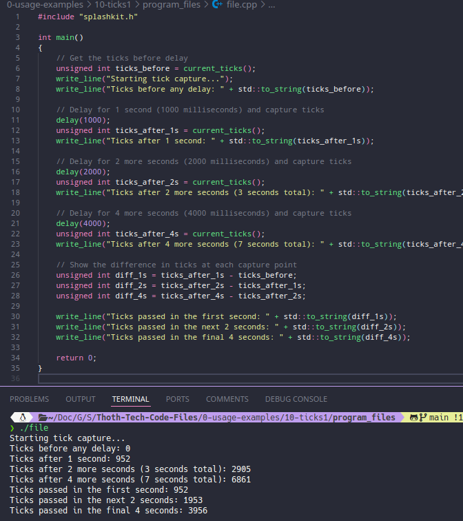
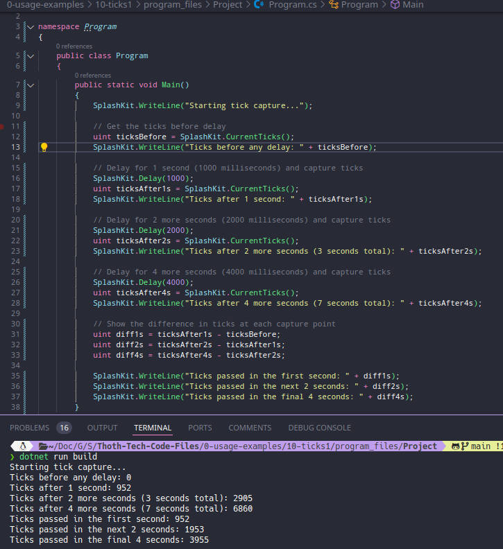
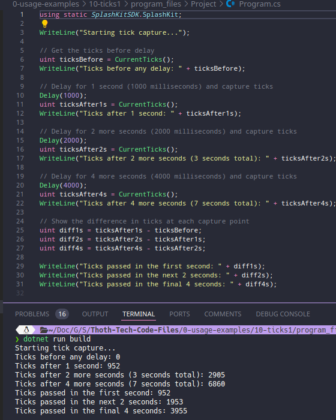
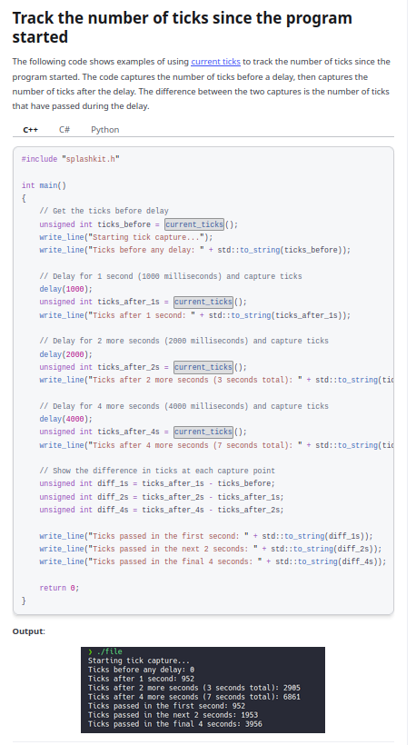

# Usage example creation for Tick Capture and Delay

This is a usage example for capturing ticks and implementing delays using SplashKit in Python. The program demonstrates how to measure elapsed time by capturing ticks before and after delays. The PR is [here](https://github.com/thoth-tech/splashkit.io-starlight/pull/999)

## Testing Python Code

## Testing the C++ Code

## Testing the C# Code

### OOP Version

### Top Level Version

## Preview of the Site

