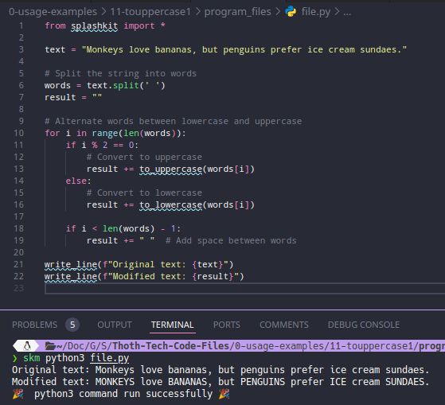
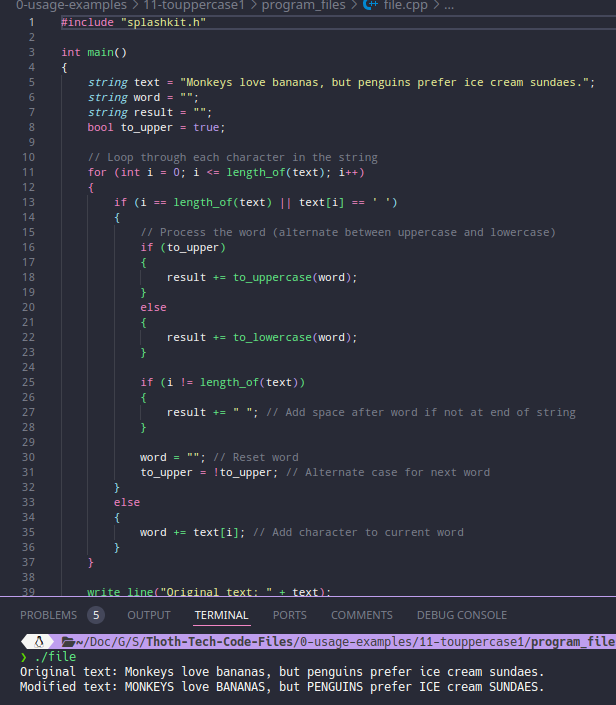
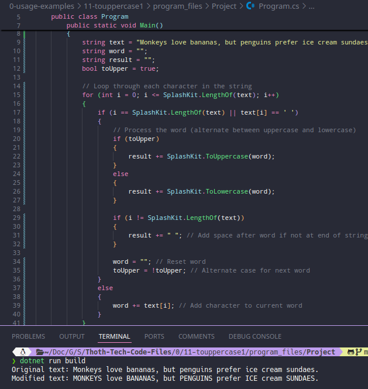
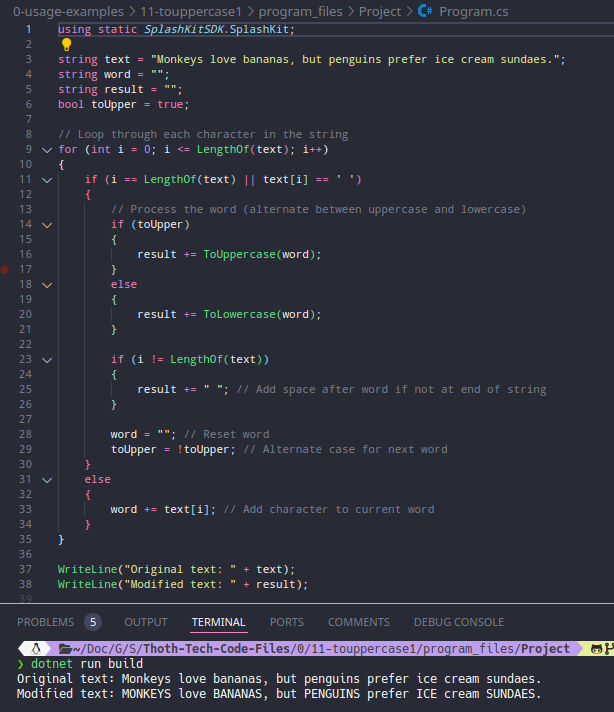

# Usage example creation for Alternate Word Case in String

This is a usage example for alternating the case of each word in a string using SplashKit. The program processes a given sentence and alternates each word between uppercase and lowercase. The PR is [here](https://github.com/thoth-tech/splashkit.io-starlight/pull/999)

## Testing Python Code

## Testing the C++ Code

## Testing the C# Code

### OOP Version

### Top Level Version

## Preview of the Site

