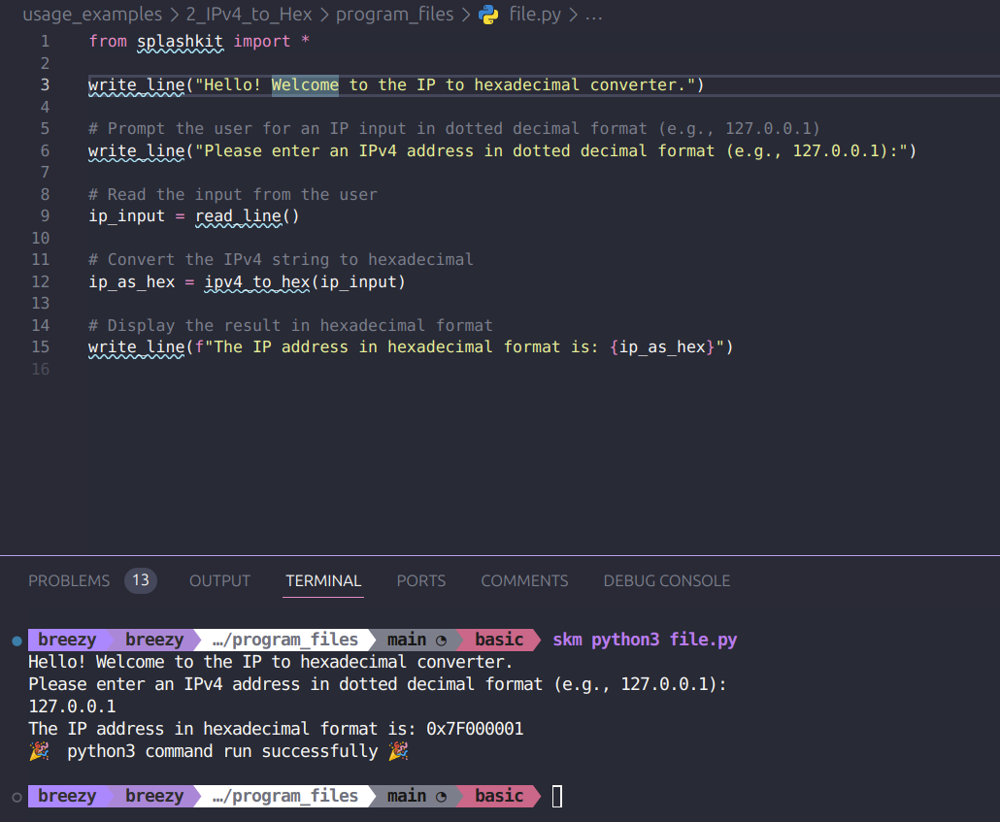
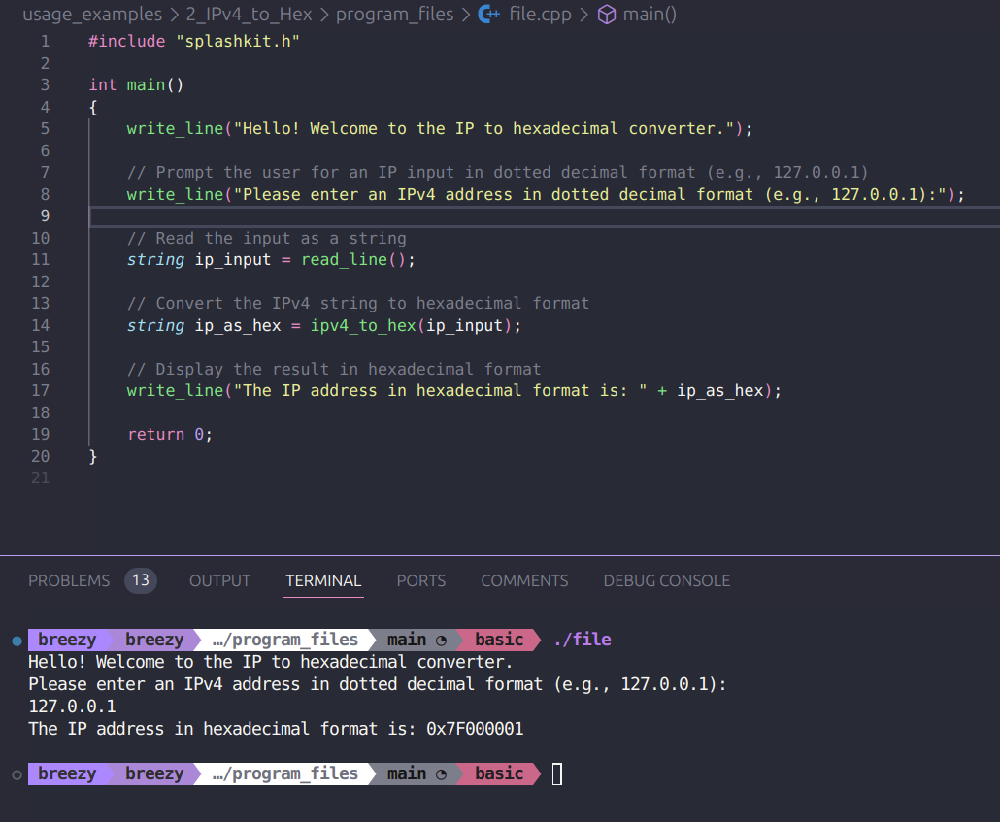
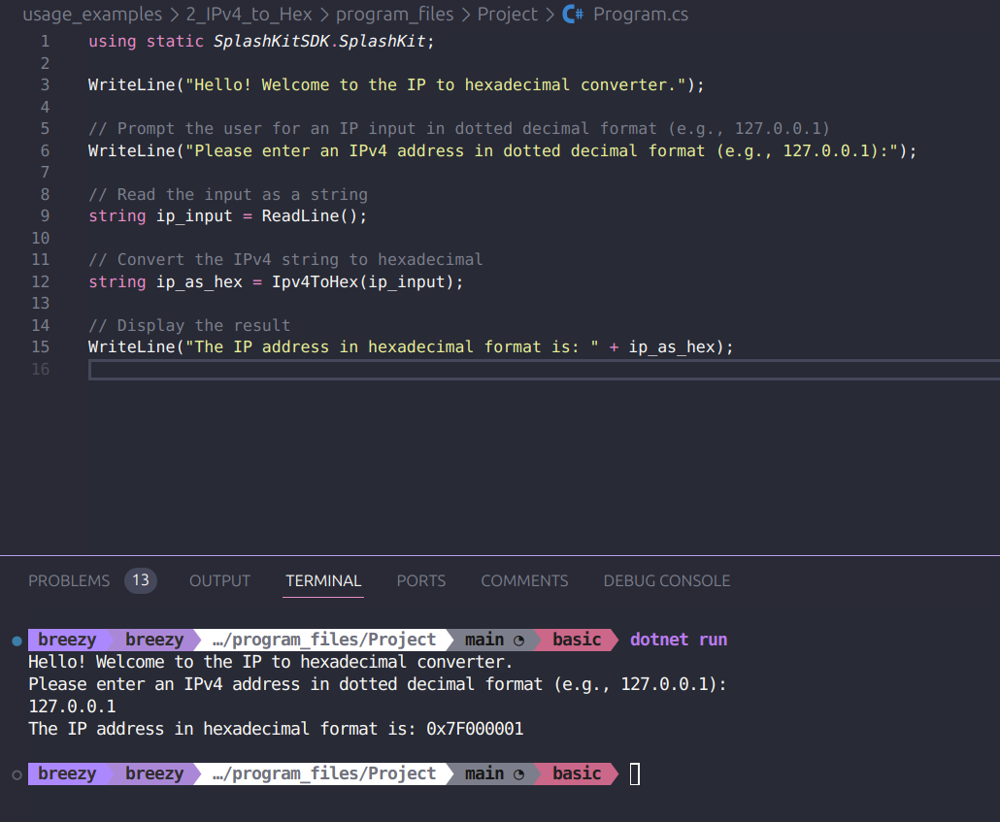
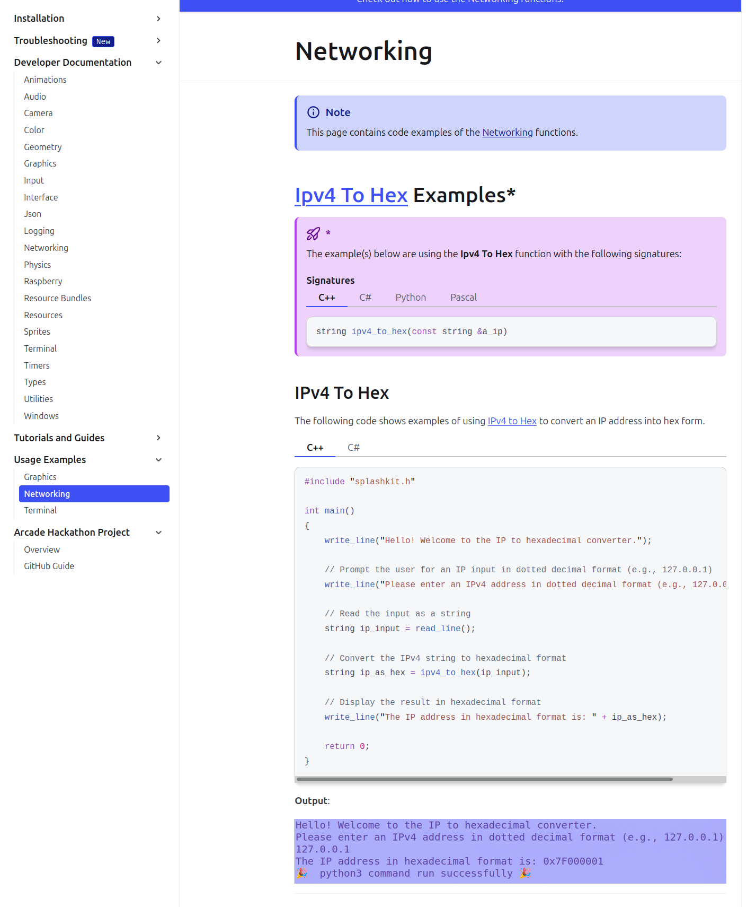
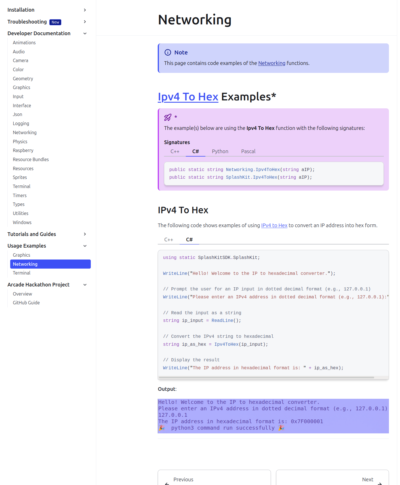

# Usage example creation for IPv4 to Hex

This is a usage example for the IPv4 to Hex conversion. It contains a small program where the user can enter in an IP address and it will convert it into hex form. The PR is [here](https://github.com/thoth-tech/splashkit.io-starlight/pull/170)

## Testing Python Code

## Testing the C++ Code

## Testing the C# Code

## Preview of the Site

