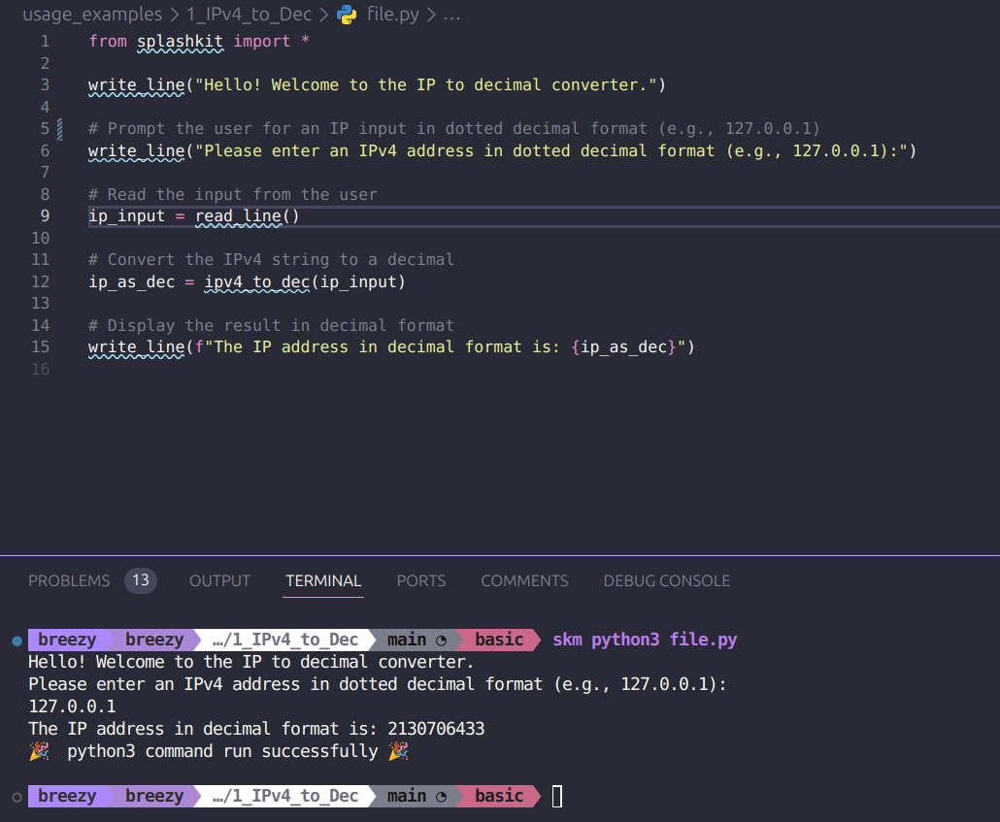

# Usage example creation for IPv4 to Dec

This is a usage example for the IPv4 to Dec conversion. It contains a small program where the user can enter in an IP address and it will convert it into decimal form. The PR is [here](https://github.com/thoth-tech/splashkit.io-starlight/pull/169)

## Testing Python Code

## Testing the C++ Code

## Testing the C# Code

