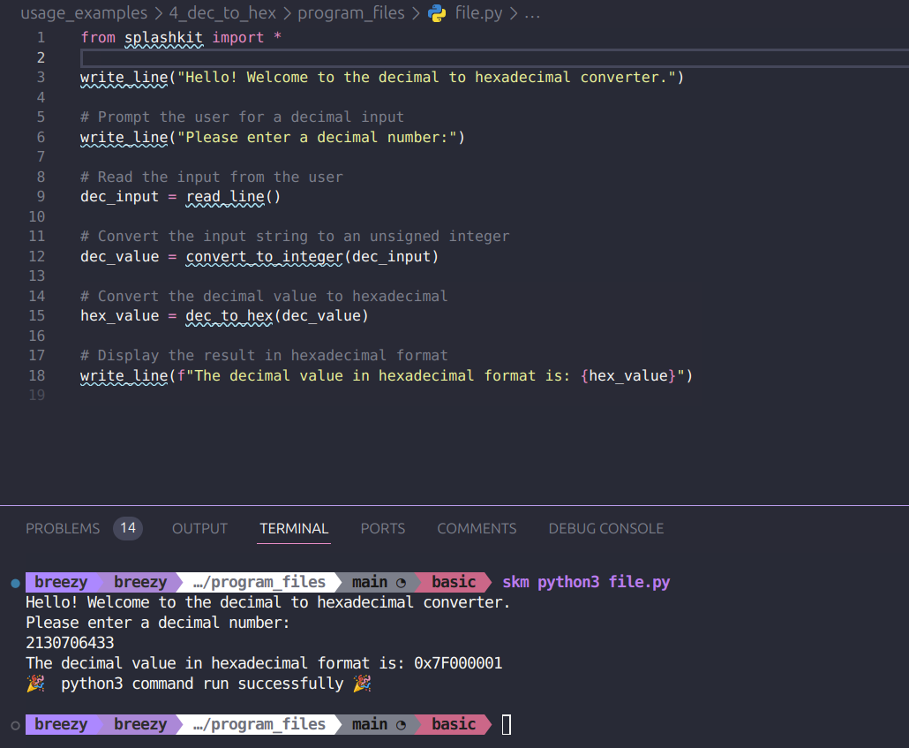
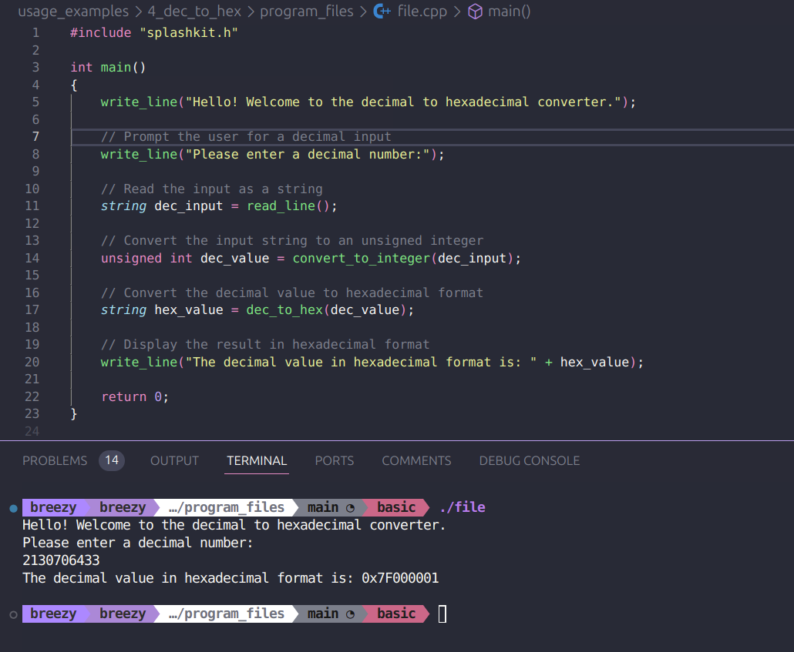
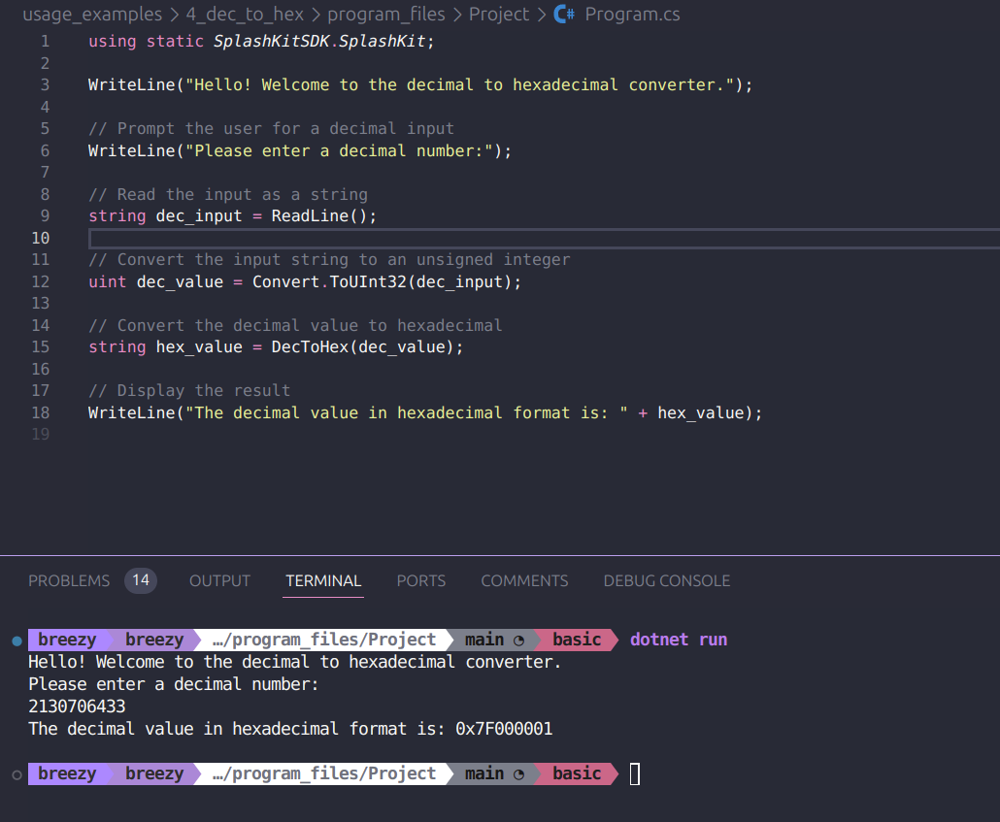

# Usage example creation for Dec to Hex

This is a usage example for the Dec to Hex conversion. It contains a small program where the user can enter in a decimal value and it will convert it to hex form. The PR is [here]()

## Testing Python Code

## Testing the C++ Code

## Testing the C# Code

