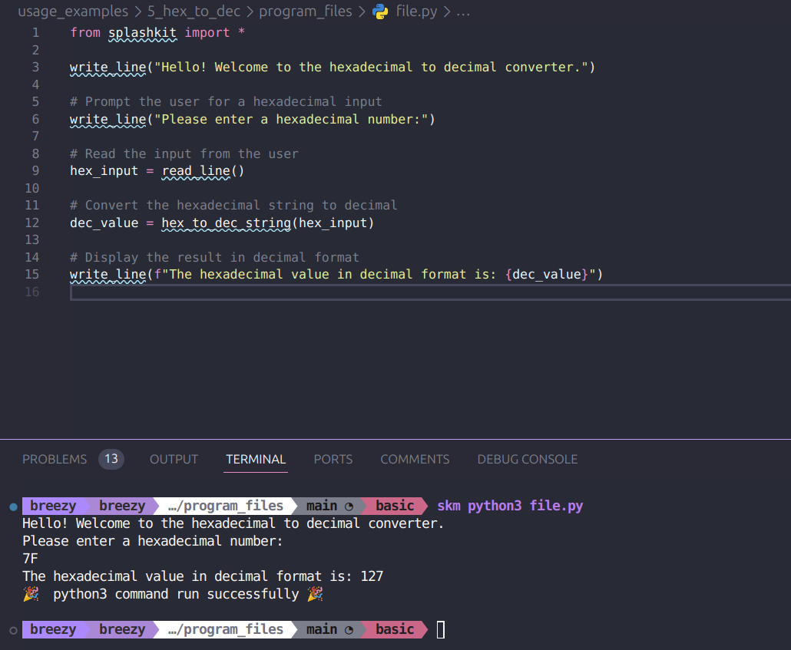
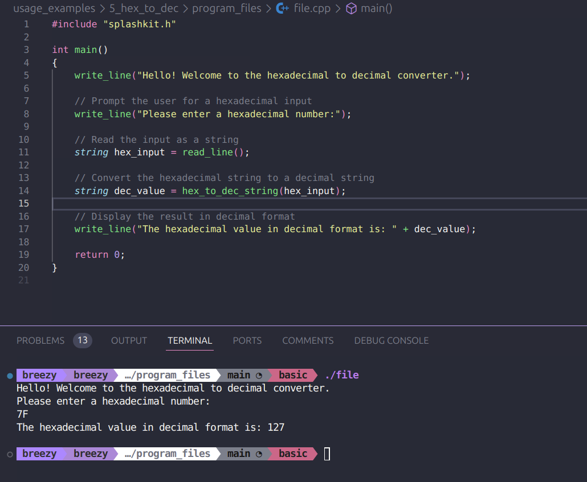
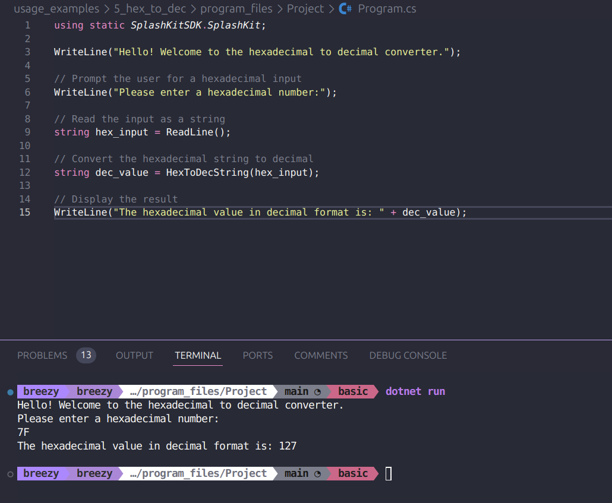

# Usage example creation for Hex to Dec

This is a usage example for the Hex to Dec conversion. It contains a small program where the user can enter in a hex value and it will convert it to decimal form. The PR is [here](https://github.com/thoth-tech/splashkit.io-starlight/pull/172)

## Testing Python Code

## Testing the C++ Code

## Testing the C# Code

